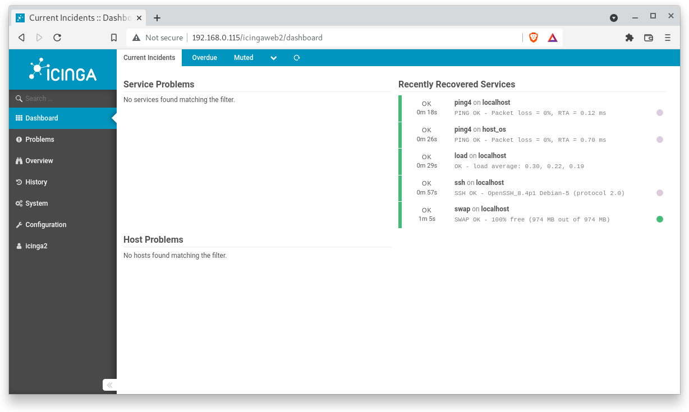

summary: BITI IPM Lab - Icinga Agentless Monitoring
id: biti-ipm-icinga-local-lab
categories: icinga
tags: ipm, icinga, BITI, introduction
status: Draft
authors: Roland Pellegrini

# BITI IPM Lab - Icinga Agentless Monitoring
<!-- ------------------------ -->
## Before You Begin 

### What You’ll Learn

Hosts and services can be monitored in two ways:

- Use of Simple Host Monitoring (Agentless)
This involves the use of services that are accessible across the local network or the Internet for example include HTTP, SSH, ICMP etc. This method is fit for monitoring hosts on which monitoring agents cannot be installed.

- Use of Monitoring Agents
In this method, an agent is required in order to monitor host and services like CPU load, disk space, memory and the running process. In this configuration, Icinga 2 acts as the master node and the remote host acts as the client node.


In this codelab you will learn

* how to monitor the availability (=state) of hosts and services agentless with Icinga2 

Hosts and services can be anything such as Network services (HTTP, SSH, etc.), printers, switches or routers, or any other local or network-accessible services. Icinga2 monitors the states of hosts and the services they offer. Each host can have the states UP and DOWN, each service can have the states OKAY, WARNING, CRITICAL and UKNOWN.

###  Where You Can Look Up

The best source of documentation is the homepage of Icinga2. The latest documentation can be found [here](https://www.icinga.com/docs/latest/doc/01-about/).

### What You'll need

#### Icinga2 instance

You need a working Icinga2 instance that you can access via IcingaWeb2 GUI. If you do not have a running Icinga2 instance, please consult the Codelab "BITI IPM Lab - Icinga Installation" how to install Icinga2 on your local computer.

#### Guest operation system (Guest OS)

This is the OS of the virtual machine. This will be Debian 11 (Bullseye).

#### Administators privileges

By default, administrator privileges are required on the Host OS to install additional software. Make sure that you have the required permissions.

For the Guest OS, you will create and manage your own users. These users will therefore be different from the Host's user administration. 

### Root privileges via sudo

In this codelab you have to work with root privileges. Therefore, a few words of caution: double check whatever you type and make backups whenever necessary.

Working with root privileges is quite easy. Open a terminal (a shell) and enter the following commmand:
```
sudo -s
```
Enter the password of the icinga user and voila:
```
root@server:/home/icinga#
```

Once you are root via sudo, it is no longer necessary to prepend the sudo command. Instead of `sudo ls -lisa /root/` you can also type `ls -lisa /root/` because you have root privileges already. However, all commands in this codelab will always start with `sudo` to remind you that you are working with root privileges.

<!-- ------------------------ -->
## Backup configuration


### Stop Icinga2 service

Since we reconfigure Icinga2, we first need to stop the service with the following command:
```
sudo systemctl stop icinga2
```

Check the service status with the following command:
```
sudo systemctl status icinga2
```

The output should look as this:
```
  icinga2.service - Icinga host/service/network monitoring system
     Loaded: loaded (/lib/systemd/system/icinga2.service; enabled; vendor prese>
     Active: inactive (dead) since Wed 2021-12-03 15:02:38 CET; 2s ago
       Docs: https://icinga.com/docs/icinga2/latest/
    Process: 796 ExecStartPre=/usr/lib/icinga2/prepare-dirs /usr/lib/icinga2/ic>
    Process: 818 ExecStart=/usr/sbin/icinga2 daemon -e ${ICINGA2_ERROR_LOG} (co>
   Main PID: 818 (code=exited, status=0/SUCCESS)
        CPU: 3.256s

Dec 03 15:02:38 server icinga2[1131]: [2021-12-03 15:02:38 +0100] information/D>
Dec 03 15:02:38 server icinga2[1131]: [2021-12-03 15:02:38 +0100] information/I>
Dec 03 15:02:38 server icinga2[1131]: [2021-12-03 15:02:38 +0100] information/I>
Dec 03 15:02:38 server icinga2[1131]: [2021-12-03 15:02:38 +0100] information/D>
Dec 03 15:02:38 server systemd[1]: Stopping Icinga host/service/network monitor>
Dec 03 15:02:38 server icinga2[1131]: [2021-12-03 15:02:38 +0100] information/C>
Dec 03 15:02:38 server icinga2[1131]: [2021-12-03 15:02:38 +0100] information/I>
Dec 03 15:02:38 server systemd[1]: icinga2.service: Succeeded.
Dec 03 15:02:38 server systemd[1]: Stopped Icinga host/service/network monitori>
Dec 03 15:02:38 server systemd[1]: icinga2.service: Consumed 3.256s CPU time.
```

Note that the status `Active` must be `inactive (dead) since XXXXXX`, indicating that the service is down. Press `Q` for quit the output. 

### Config.d directory

After a basic Icinga2 installation, there are already some sample files for monitoring the local server. All files can be found in the following directory:

```
sudo ls -al /etc/icinga2/conf.d/
```

The `ls -al` command displays the following configuration files in detail:


```
drwxr-x--- 2 root   root   4096 Dec  7 14:15 .
drwxr-x--- 9 nagios nagios 4096 Dec  7 14:19 ..
-rw-r--r-- 1 root   root     35 Dec  7 14:15 app.conf
-rw-r--r-- 1 root   root    114 Dec  7 14:15 apt.conf
-rw-r--r-- 1 root   root   5297 Dec  7 14:15 commands.conf
-rw-r--r-- 1 root   root    542 Dec  7 14:15 downtimes.conf
-rw-r--r-- 1 root   root    638 Dec  7 14:15 groups.conf
-rw-r--r-- 1 root   root   1500 Dec  7 14:15 hosts.conf
-rw-r--r-- 1 root   root    793 Dec  7 14:15 notifications.conf
-rw-r--r-- 1 root   root   2131 Dec  7 14:15 services.conf
-rw-r--r-- 1 root   root   2060 Dec  7 14:15 templates.conf
-rw-r--r-- 1 root   root    732 Dec  7 14:15 timeperiods.conf
-rw-r--r-- 1 root   root    308 Dec  7 14:15 users.conf
```

These can be very helpful if you want to get an insight into the structure of the configuration files. However, since we want to create our own files and structure here, these files are not needed for this lab.

### How to backup

The easiest way is to move the configuration files to another folder. Run the following commands to backup the Icinga2 config files:

```
sudo cd /etc/icinga2
sudo cp -R conf.d/ conf.d.backup/
sudo cd conf.d/
sudo rm *
sudo ls -al
```

The commands above create a backup directory (conf.b.backup)and delete all configurations in the conf.d directory. The last command will show an empty directory:
```
root@server:/etc/icinga2/conf.d# sudo ls -la
total 8
drwxr-x--- 2 root   root   4096 Dec  7 14:19 .
drwxr-x--- 9 nagios nagios 4096 Dec  7 14:19 ..
```

In contrast, the backup directory will still have the original configuration files. You can check this with the following command:
```
root@server:/etc/icinga2/conf.d# sudo ls -la /etc/icinga2/conf.d.backup/
total 56
drwxr-x--- 2 root   root   4096 Dec  7 14:15 .
drwxr-x--- 9 nagios nagios 4096 Dec  7 14:19 ..
-rw-r--r-- 1 root   root     35 Dec  7 14:15 app.conf
-rw-r--r-- 1 root   root    114 Dec  7 14:15 apt.conf
-rw-r--r-- 1 root   root   5297 Dec  7 14:15 commands.conf
-rw-r--r-- 1 root   root    542 Dec  7 14:15 downtimes.conf
-rw-r--r-- 1 root   root    638 Dec  7 14:15 groups.conf
-rw-r--r-- 1 root   root   1500 Dec  7 14:15 hosts.conf
-rw-r--r-- 1 root   root    793 Dec  7 14:15 notifications.conf
-rw-r--r-- 1 root   root   2131 Dec  7 14:15 services.conf
-rw-r--r-- 1 root   root   2060 Dec  7 14:15 templates.conf
-rw-r--r-- 1 root   root    732 Dec  7 14:15 timeperiods.conf
-rw-r--r-- 1 root   root    308 Dec  7 14:15 users.conf
```

After running the commands, we are now able to create our own configuration structure in the next section.

<!-- ------------------------ -->
## Create template files

To save work for further configuration, we create two templates: a host and a service template. Template files may contain basic settings (or default settings) which are used 

<!-- ------------------------ -->
### templates.conf

The `templates.conf` file contains basic settings for monitoring hosts (e.g. servers) and services (e.g. HTTP service, SSH service).

First, create an empty file:
```
sudo touch /etc/icinga2/conf.d/templates.conf
```

Next, open the file with an editor:
```
sudo nano /etc/icinga2/conf.d/templates.conf
```

Next, copy the following content in to the template file:
```
template Host "generic-host" {
  max_check_attempts = 3
  check_interval = 5m  
  retry_interval = 150s 
}

template Service "generic-service" {
  max_check_attempts = 3
  check_interval = 1m  
  retry_interval = 30s 
}
```
Where,

* template - the key word
* Host / Service- template type (type can be Host, Service, User, Period, etc.)
* "generic-host" / "generic-service" - name of the template
* max_check_attempts - specifies how often a check may fail before a reaction is triggered
* check_interval - specifies after how many minutes/seconds a check should be repeated if no failures occur
* retry_interval -specifies after how many minutes/seconds a check should be repeated if failures occur

<aside class="positive">
Note that you can change the values for max_check_attempts, check_interval and retry_interval according to your specifications. Again, the templates.conf specifies basic settings. Therefore, the basic settings can always be overwritten in the hosts and/or services files.
</aside>

Quit the configuration file with `CTRL-X` and confirm with `y` to save all changes. 

<!-- ------------------------ -->
## Create commands file

### Commands.conf

The **commands.conf** file contains information how command_checks are triggered by Icinga2. Since the explaination of all check_commands is out of scope of this codelab, simple restore the previously saved commands.conf file into the conf.d/ directory and we are fine here. 

```
sudo cp /etc/icinga2/conf.d.backup/commands.conf /etc/icinga2/conf.d/commands.conf
```

### Check for completeness
At this point, let's see what we have. Run the following command:

```
sudo ls -al /etc/icinga2/conf.d/
```

The output must look like this:
```
total 24
drwxr-x--- 2 root   root   4096 Dec  7 14:15 .
drwxr-x--- 9 nagios nagios 4096 Dec  7 14:19 ..
-rw-r--r-- 1 root   root   5297 Dec  7 14:15 commands.conf
-rw-r--r-- 1 root   root   2060 Dec  7 14:15 templates.conf
```

If the output does not show the two files `commands.conf` and `templates.conf` or if the file size is very different, then delete everything in this directory and start over.

## Create hosts file

Usually, the `hosts.conf` file defines the configuration for all hosts to be monitored. However, managing all hosts in a single file leads to very confusing and costly maintenance. To keep it simple, we create a new folder where we define several hosts files according to their intended use. 

For this codelab, we will create the following host files:

* localhost.conf - the GuestOS
* host_os.conf - the HostOS

Note that we do not install monitoring agents on the HostOS system (e.g. your PC or Laptop). In this codelab, we instead use a simple approach to monitoring the target system, also known as agentless monitoring. This approach is used when installing agents is not possible.

### localhost.conf

We will start with the monitoring of our GuestOS system called `localhost`.

```
sudo mkdir /etc/icinga2/conf.d/hosts/
```

To check the Icinga2 host we name the file `localhost.conf`.

```
sudo touch /etc/icinga2/conf.d/hosts/localhost.conf
```

Next, open the file with an editor:
```
sudo nano /etc/icinga2/conf.d/hosts/localhost.conf
```

Next, copy the following content in to the `localhost.conf` file:
```
object Host "localhost"{
  import  "generic-host"
  address = "127.0.0.1"
  check_command = "hostalive"
}

object Service "ping4" {
  host_name = "localhost"
  check_command = "ping4"
}

object Service "swap"{
  host_name = "localhost"
  check_command = "swap"
}

object Service "load"{
  host_name = "localhost"
  check_command = "load"
}

object Service "ssh"{
  host_name = "localhost"
  check_command = "ssh"
}
```

In this example, we create an `object` named `localhost` for the Icinga2 host. In this object we import the template `generic-host` which we created previously. Next, we specify the IP address of the host we want to monitor. Since we monitor the local host, we use the ip address of the loopback device (127.0.0.1). Finally, we create the first check directly for the host (here: hostalive).

<aside class="positive">
The hostalive command is one of several built-in check commands. It sends ICMP echo requests to the IP address specified in the address attribute to determine whether a host is online.
</aside>

The example above also creates four (4) services: ping4, swap, load and ssh. All services belong to the host `localhost` as defined in the first line. Each service also specifies the corresponding check_commands such as "ssh" or "load" which is triggered by Icinga2.

Finally, do not forget to quit the editor with `CTRL-X`. Confirm with `y` to save all changes. 

### host_os.conf

This section shows you how to monitor your HostOS system without using monitoring agents.

We use the same directory structure as in the Localhost section. We assume that all the directories exist. If not, you will need to create the Host directory.

```
sudo mkdir /etc/icinga2/conf.d/hosts/
```

To check the HostOs we name the file `host_os.conf`.

```
sudo touch /etc/icinga2/conf.d/hosts/host_os.conf
```

Next, open the file with an editor:
```
sudo nano /etc/icinga2/conf.d/hosts/host_os.conf
```

Next, copy the following content in to the `host_os.conf` file:
```
object Host "host_os"{
  import  "generic-host"
  address = "<ip-address of the hostos>"
  check_command = "hostalive"
}

object Service "ping4" {
  host_name = "host_os"
  check_command = "ping4"
}

```

In this example, we must first specify the IP address of the HostOS we want to monitor. Find out the IP address of the HostOS and enter it in the appropriate field. Further we implement one (1) service named `ping4` to check if the HostOs is reachable or not.

Finally, do not forget to quit the editor with `CTRL-X`. Confirm with `y` to save all changes. 

### Check for completeness

Again, at this point, let's see what we have. Run the following command:

```
sudo ls -al /etc/icinga2/conf.d/hosts/
```

The output must look like this:
```
drwxr-xr-x 2 root   root   4096 Dec  8 20:59 .
drwxr-x--- 3 nagios nagios 4096 Dec  8 20:59 ..
-rw-r--r-- 1 root   root    196 Dec  8 20:59 host_os.conf
-rw-r--r-- 1 root   root    440 Dec  8 20:58 localhost.conf
```
If the output does not show the two files `host_os.conf` and `localhost.conf` or if the file size is very different, then delete everything in this directory and start over.

## Test and restart

### Test the configuration
Before restarting the Icinga2 service, it is a good idea to validate the configuration files. We can do this with the following command:

```
sudo icinga2 daemon -C
```

In case of invalid entries, the command will output an error message like this:
```
[2021-12-03 15:49:12 +0100] information/cli: Icinga application loader (version: r2.12.3-1)
[2021-12-03 15:49:12 +0100] information/cli: Loading configuration file(s).
[2021-12-03 15:49:12 +0100] critical/config: Error: syntax error, unexpected T_STRING
Location: in /etc/icinga2/conf.d/hosts/hostos.conf: 3:11-3:25
/etc/icinga2/conf.d/hosts/host_os.conf(1): object Host "host_os" {
/etc/icinga2/conf.d/hosts/host_os.conf(2):   import "generic-host"
/etc/icinga2/conf.d/hosts/host_os.conf(3):   address "192.168.0.188"
                                                    ^^^^^^^^^^^^^^^
/etc/icinga2/conf.d/hosts/host_os.conf(4):   check_command = "hostalive"
/etc/icinga2/conf.d/hosts/host_os.conf(5): }

[2021-12-03 15:49:12 +0100] critical/cli: Config validation failed. Re-run with 'icinga2 daemon -C' after fixing the config.
```
The output shows that there is a syntax error in the file **host_os.conf**. The line 3 is marked with wavy line, indicating that something is wrong here. Experts like you immediately recognize that the equal sign (=) between the string **address** and **192.168.0.188** is missing. After fixing this typo, lets run the command again:

```
sudo icinga2 daemon -C
```

The output now lists an overview of all configuration files and instantiated configuration items, indicating that we are fine here.
```
[2021-12-03 15:48:00 +0100] information/cli: Icinga application loader (version: r2.12.3-1)
[2021-12-03 15:48:00 +0100] information/cli: Loading configuration file(s).
[2021-12-03 15:48:00 +0100] information/ConfigItem: Committing config item(s).
[2021-12-03 15:48:01 +0100] information/ConfigItem: Instantiated 1 NotificationComponent.
[2021-12-03 15:48:01 +0100] information/ConfigItem: Instantiated 1 IdoMysqlConnection.
[2021-12-03 15:48:01 +0100] information/ConfigItem: Instantiated 1 CheckerComponent.
[2021-12-03 15:48:01 +0100] information/ConfigItem: Instantiated 3 Zones.
[2021-12-03 15:48:01 +0100] information/ConfigItem: Instantiated 7 Services.
[2021-12-03 15:48:01 +0100] information/ConfigItem: Instantiated 1 IcingaApplication.
[2021-12-03 15:48:01 +0100] information/ConfigItem: Instantiated 4 Hosts.
[2021-12-03 15:48:01 +0100] information/ConfigItem: Instantiated 2 NotificationCommands.
[2021-12-03 15:48:01 +0100] information/ConfigItem: Instantiated 1 Endpoint.
[2021-12-03 15:48:01 +0100] information/ConfigItem: Instantiated 1 FileLogger.
[2021-12-03 15:48:01 +0100] information/ConfigItem: Instantiated 235 CheckCommands.
[2021-12-03 15:48:01 +0100] information/ScriptGlobal: Dumping variables to file '/var/cache/icinga2/icinga2.vars'
[2021-12-03 15:48:01 +0100] information/cli: Finished validating the configuration file(s).
```

### Start Icinga2 service

After reconfiguring the configuration files, we can start the service with the following command:
```
sudo systemctl start icinga2
```

Check the service status with the following command:
```
sudo systemctl status icinga2
```
The output should look as this:
```
  icinga2.service - Icinga host/service/network monitoring system
     Loaded: loaded (/lib/systemd/system/icinga2.service; enabled; vendor preset: enabled)
     Active: active (running) since Wed 2021-12-03 16:07:57 CET; 3min 9s ago
       Docs: https://icinga.com/docs/icinga2/latest/
    Process: 5628 ExecStartPre=/usr/lib/icinga2/prepare-dirs /usr/lib/icinga2/icinga2 (code=exited, status=0/SUCCESS)
   Main PID: 5633 (icinga2)
      Tasks: 18 (limit: 2324)
     Memory: 12.4M
        CPU: 797ms
     CGroup: /system.slice/icinga2.service
             ├─5633 /usr/lib/x86_64-linux-gnu/icinga2/sbin/icinga2 --no-stack-rlimit daemon -e
             ├─5654 /usr/lib/x86_64-linux-gnu/icinga2/sbin/icinga2 --no-stack-rlimit daemon -e
             └─5659 /usr/lib/x86_64-linux-gnu/icinga2/sbin/icinga2 --no-stack-rlimit daemon -e

Dec 03 16:07:57 server icinga2[5654]: [2021-12-03 16:07:57 +0100] information/DbConnection: 'ido-mysql' started.
Dec 03 16:07:57 server icinga2[5654]: [2021-12-03 16:07:57 +0100] information/NotificationComponent: 'notification' started.
Dec 03 16:07:57 server icinga2[5654]: [2021-12-03 16:07:57 +0100] information/CheckerComponent: 'checker' started.
Dec 03 16:07:57 server icinga2[5654]: [2021-12-03 16:07:57 +0100] information/ConfigItem: Activated all objects.
Dec 03 16:07:57 server icinga2[5654]: [2021-12-03 16:07:57 +0100] information/IdoMysqlConnection: 'ido-mysql' resumed.
Dec 03 16:07:57 server icinga2[5654]: [2021-12-03 16:07:57 +0100] information/DbConnection: Resuming IDO connection: ido-mysql
Dec 03 16:07:57 server icinga2[5654]: [2021-12-03 16:07:57 +0100] information/IdoMysqlConnection: MySQL IDO instance id: 1 (schema version: '1.14.3')
Dec 03 16:07:57 server icinga2[5654]: [2021-12-03 16:07:57 +0100] information/IdoMysqlConnection: Finished reconnecting to 'ido-mysql' database 'icinga2' in 0.0624042 second(s).
Dec 03 16:08:07 server icinga2[5654]: [2021-12-03 16:08:07 +0100] information/IdoMysqlConnection: Pending queries: 9 (Input: 3/s; Output: 2/s)
Dec 03 16:09:27 server icinga2[5654]: [2021-12-03 16:09:27 +0100] information/IdoMysqlConnection: Pending queries: 10 (Input: 3/s; Output: 2/s)
```

Note that the status `Active` must be `active (running) since XXXXXX`, indicating that the service is up and running.

## Icinga Web 2

If the restart of the icinga2 service was successful, we will see the host with the checks we just created in the web frontend of Icinga2. 

Do not worry if the checks are in pending state. Icinga2 needs some time to process the results of the checks. Meanwhile, note the layout of the dashboard: (1) Service problems, (2) Host problems and (3) Recently Recovered Services. Depending on the status, noticifations show up in one of the three layout cards.


As you can see, more and more checks will move to the card `Recently Recovered Services`


Finally, all checks should operate in normal state. No service or host problems occur.



## Cleanup

Congratulations !

You have successfully set up your first host for agentless monitoring with standard CheckCommands.