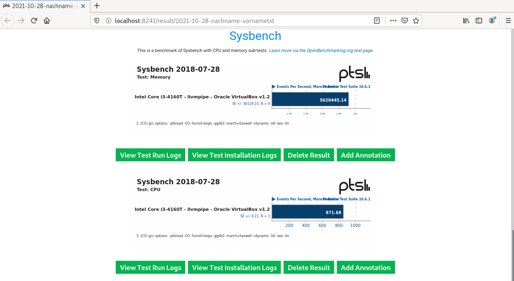

summary: BITI IPM Lab - Benchmark
id: biti-ipm-benchmark-linux-lab
categories: linux
tags: ipm, benchmark, BITI, introduction
status: Published
authors: Roland Pellegrini

# BITI IPM Lab - Benchmark

<!-- ------------------------ -->

## Before You Begin

The Phoronix Test Suite is a comprehensive testing and benchmarking platform available for the Linux operating system. This software is designed to carry out both qualitative and quantitative benchmarks in a clean, reproducible, and easy-to-use manner. It consists of a lightweight processing core (pts-core) with each benchmark consisting of an XML-based profile with related resource scripts.

The Phoronix Test Suite contains profiles for various individual tests, whereby only external programs are used. When a test is started for the first time, the required programs and data are automatically downloaded from the network and stored in the directory ~/.phoronix-test-suite/installed-tests. Within the Phoronix Test Suite single tests are called benchmarks, whereas combinations of single tests are called suites.

### What You’ll Learn

In this codelab you will learn

- the Phoronix Test Suite
- how to perform a benchmark run

### Where You Can Look Up

Documentation about the Phoronix Test Suite can be found [here](https://www.phoronix-test-suite.com).

### What You'll need

#### Guest operation system (Guest OS)

This is the OS of the virtual machine. This will be Debian .

#### Administators privileges

By default, administrator privileges are required on the Host OS to install additional software. Make sure that you have the required permissions.

For the Guest OS, you will create and manage your own users. These users are therefore be different from the Host's user administration.

## Installation

### Description

First, you need to download and install the installation package. Go to the [Phoronix download page](http://www.phoronix-test-suite.com/?k=downloads) and download the `Ubuntu/Debian Package` to the computer which you want to run the tests.

Next, run the install process by executing the following two (2) commands:

```
sudo dpkg -i phoronix-test-suite_10.6.1_all.deb
sudo apt-get install -f
```

Once the software suite is installed, go ahead and start the program: 

```
phoronix-test-suite
```

You will be asked a couple of questions. Finally, the program will display the User Agreement License (UAL). Note, that you have to accept the terms, but do not enable anonymus usage.

```
Do you agree to these terms and wish to proceed (y/n): Y
Enable anonymous usage / statistics reporting (y/n): N
```

<aside class="negative">
Again: Do not enable anonymus usage.
</aside>

### References

Need help? Use this link:

[Phoronix Documentation](https://github.com/phoronix-test-suite/phoronix-test-suite/blob/master/documentation/phoronix-test-suite.md)

## Information

### Description

The following command retrieves detailed information about the installed system hardware and software identified by the Phoronix Test Suite.
```
phoronix-test-suite system-info
```

Example output:

```
Phoronix Test Suite v10.6.1
System Information


  PROCESSOR:              Intel Core i3-4160T
    Core Count:           1
    Extensions:           SSE 4.2 + AVX2 + AVX + RDRAND + FSGSBASE
    Cache Size:           3 MB
    Core Family:          Haswell

  GRAPHICS:               llvmpipe
    OpenGL:               4.5 Mesa 20.3.5 (LLVM 11.0.1 256 bits)
    Screen:               1152x864
--More--
```

The following command provides various hardware/software system properties detected by the Phoronix Device Interface (Phodevi) library.

```
phoronix-test-suite system-properties
```

Example output:

```
AUDIO
     identifier = Intel 82801AA AC 97 Audio

CHIPSET
     identifier = Intel 440FX 82441FX PMC

CPU
     identifier = Intel Core i3-4160T (1 Core)
     model = Intel Core i3-4160T
     model-and-speed = Intel Core i3-4160T
     mhz-default-frequency = 0
     default-frequency =
--More--
```

## Available Test

### Description

There are many different tests that you can use. Execute the following command to see which ones are available:

```
phoronix-test-suite list-available-tests
```

Example output:

```
Phoronix Test Suite v10.6.1
Available Tests

pts/ai-benchmark            AI Benchmark Alpha                                System
pts/aircrack-ng             Aircrack-ng                                       Processor
pts/amg                     Algebraic Multi-Grid Benchmark                    Processor
pts/aobench                 AOBench                                           Processor
pts/aom-av1                 AOM AV1                                           Processor
pts/apache                  Apache HTTP Server                                System
pts/apache-siege            Apache Siege                                      System
pts/appleseed               Appleseed                                         System
pts/arrayfire               ArrayFire                                         Processor
pts/ashes-escalation        Ashes of the Singulairty: Escalation              Graphics
--More--
```

If you want to run a multiple tests, run the following command to get a list of tests-suites:

```
phoronix-test-suite list-available-suites
```

Example output:

```
Phoronix Test Suite v10.6.1
Available Suites

  pts/audio-encoding               - Audio Encoding                   System
  pts/av1                          - AV1                              System
  pts/bioinformatics               - Bioinformatics                   System
  pts/browsers                     - Web Browsers                     System
  pts/cad                          - CAD                              System
  pts/chess                        - Chess Test Suite                 Processor
  pts/database                     - Database Test Suite              System
  pts/desktop-graphics             - Desktop Graphics                 System
  pts/game-dev                     - Game Development                 System
  pts/hpc                          - HPC - High Performance Computing System
  pts/imaging                      - Imaging                          System
  pts/java                         - Java                             System
  pts/network                      - Networking Test Suite            Network
  pts/nvidia-gpu-compute           - NVIDIA GPU Compute               Graphics
--More--
```

Run the following command to obtain detailed information on a specific test:

```
phoronix-test-suite info [test]
```

If you know (or have been told) which test you want to run, you must first install the test dependencies before you can run it. The following example will install the Java test suite:

```
phoronix-test-suite install pts/java
```

Again, if you want to know more on `pts/java`, run the following command:

```
phoronix-test-suite info pts/java
```

The command above will show you core information about the `pts/java` suite. Section `Contained Tests` will list all tests that are included in this suite.

```
Phoronix Test Suite v10.6.1
Java

Suite Description:  The Java test suite contains all Java-based test profiles within the Phoronix Test Suite.

Run Identifier:     pts/java-1.1.1
Suite Version:      1.1.1
Maintainer:         Michael Larabel
Status:
Suite Type:         System
Unique Tests:       7
Contained Tests:
                    Sunflow Rendering System
                    Bork File Encrypter
                    Java SciMark              Computational Test: Composite
                    Java SciMark              Computational Test: Fast Fourier Transform
                    Java SciMark              Computational Test: Jacobi Successive Over-Relaxation
                    Java SciMark              Computational Test: Monte Carlo
                    Java SciMark              Computational Test: Sparse Matrix Multiply
                    Java SciMark              Computational Test: Dense LU Matrix Factorization
                    DaCapo Benchmark          Java Test: Eclipse
                    DaCapo Benchmark          Java Test: H2
                    DaCapo Benchmark          Java Test: Jython
                    DaCapo Benchmark          Java Test: Tradebeans
                    DaCapo Benchmark          Java Test: Tradesoap
                    Java Gradle Build         Gradle Build: Reactor
                    Java JMH
                    Renaissance               Test: Akka Unbalanced Cobwebbed Tree
                    Renaissance               Test: Savina Reactors.IO
                    Renaissance               Test: Apache Spark ALS
                    Renaissance               Test: Random Forest
                    Renaissance               Test: Apache Spark Bayes
                    Renaissance               Test: Apache Spark PageRank
                    Renaissance               Test: In-Memory Database Shootout
                    Renaissance               Test: Scala Dotty
                    Renaissance               Test: Finagle HTTP Requests
                    Renaissance               Test: Genetic Algorithm Using Jenetics + Futures
                    Renaissance               Test: ALS Movie Lens
                    33 Tests / 7 Unique Tests
```

To run the benchmark, just execute the following command:

```
phoronix-test-suite run pts/java
```

<aside class="positive">
You can perform each test individually or several at once. Regardless of whether you run one or more tests, you can run them in interactive mode or batch mode. Batch mode is ideal if you want to run many tests without babysitting.
</aside>

## Hands-On

### What you will learn:

In this codelab, you will learn

- how to use the phoronix-test-suite
- how to execute a benchmark run
- how to read the results

### What you will need:

In this codelab, you will need the following tool:

- phoronix-test-suite

### What you are not allowed to do:

This practical exercise will use the test suite `pts/sysbench-1.0.0` for demonstration purposes. You will need to use a different test suite for your assignment, okay?

<aside class="negative">
Do not use this test suite for your work. You have to choose your own test.
</aside>

### Scenario

In this Codelab, the GuestOS is a virtual machine with 2 CPU cores and 4 GB RAM. The guest operating system is based on Debian with Linux kernel version 5.10.0-8-amd64. The VM runs on the Linux-based hypervisor VirtualBox, version 6.1.16 r140961 (QT 5.11.3). The HostOS is based on Debian with Linux kernel version 4.19.0-17-amd64. The host hardware is an HP Prodesk 400 G1 DN with an Intel Core i3-4160T CPU@3.10GHz, 16GB RAM and an Intenso SATA III Top 512GB.

### Test Run

Open a shell terminal and run the following command:

```
phoronix-test-suite run pts/sysbench-1.0.0
```

First, phoronox will show you a list of new or updated tests. In most cases, you can simple ignore this output.

```
Updated OpenBenchmarking.org Repository Index
pts: 478 Distinct Tests, 1926 Test Versions, 59 Suites
Available Changes From 8 October To 28 October
Updated Test:   pts/aom-av1      v3.2.0  AOM AV1
Updated Test:   pts/astcenc      v1.3.0  ASTC Encoder
Updated Test:   pts/compress-rar v1.2.0  RAR Compression
Updated Test:   pts/dav1d        v1.11.1 dav1d
New Test:       pts/hl2-ep2      v1.0.0  Half-Life 2: Episode Two
Updated Test:   pts/kvazaar      v1.1.0  Kvazaar
Updated Test:   pts/npb          v1.4.5  NAS Parallel Benchmarks
Updated Test:   pts/opencv       v1.1.0  OpenCV
New Test:       pts/pyhpc        v1.0.0  PyHPC Benchmarks
Updated Suite:  pts/hpc          v1.1.4  HPC - High Performance Computing
Updated Suite:  pts/python       v1.1.2  Python
Updated Suite:  pts/steam        v1.0.4  Steam
Updated OpenBenchmarking.org Repository Index
system: 40 Distinct Tests, 115 Test Versions
Available Changes From 8 October To 28 October
Updated Test:  system/compress-zstd v1.5.0  Zstd Compression
Updated Test:  system/gimp          v1.1.3  GIMP
New Test:      system/mysql         v1.0.0  MySQL
New Test:      system/nginx         v1.0.0  Nginx
Updated Test:  system/openssl       v1.1.2  OpenSSL
Updated Test:  system/redis         v1.1.0  Redis Memtier / Redis Benchmark
Updated Test:  system/selenium      v1.0.25 Selenium
Updated OpenBenchmarking.org Repository Index
git: 8 Distinct Tests, 10 Test Versions
```

Next, if not installed, Phoronix ask you to install the test `pts/sysbench-1.0.0`. Enter `Y` to proceed.

```
    [PROBLEM] pts/sysbench-1.0.0 is not installed.
    Would you like to stop and install these tests now (Y/n): y
```

Next, Phoronix starts downloading and installing the test `pts/sysbench-1.0.0`.

```
    Evaluating External Test Dependencies ..............................................................................................
    To Install:    pts/sysbench-1.0.0

    Determining File Requirements ......................................................................................................
    Searching Download Caches ..........................................................................................................

    1 Test To Install
        1 File To Download [2.14MB]
        45MB Of Disk Space Is Needed
        38 Seconds Estimated Install Time

    pts/sysbench-1.0.0:
        Test Installation 1 of 1
        1 File Needed [2.14 MB]
        Downloading: sysbench-20180728.zip                                                                                      [2.14MB]
        Downloading ....................................................................................................................
        Approximate Install Size: 45 MB
        Estimated Install Time: 38 Seconds
        Installing Test @ 15:35:42
```

Next, Phoronix asks you to select one or more test options. Choose `3` to proceed.

```
Sysbench 2018-07-28:
    pts/sysbench-1.0.0
    System Test Configuration
        1: CPU
        2: Memory
        3: Test All Options
        ** Multiple items can be selected, delimit by a comma. **
        Test: 3
```

Next, Phoronix displays a system information of your GuestOS.

```
System Information


  PROCESSOR:              Intel Core i3-4160T
    Core Count:           1
    Extensions:           SSE 4.2 + AVX2 + AVX + RDRAND + FSGSBASE
    Cache Size:           3 MB
    Core Family:          Haswell

  GRAPHICS:               llvmpipe
    OpenGL:               4.5 Mesa 20.3.5 (LLVM 11.0.1 256 bits)
    Vulkan:               1.0.2
    Screen:               1280x800

  MOTHERBOARD:            Oracle VirtualBox v1.2
    BIOS Version:         VirtualBox
    Chipset:              Intel 440FX 82441FX PMC
    Audio:                Intel 82801AA AC 97 Audio
    Network:              Intel 82540EM

  MEMORY:                 2048MB

  DISK:                   52GB VBOX HDD
    File-System:          ext4
    Mount Options:        errors=remount-ro relatime rw
    Disk Scheduler:       MQ-DEADLINE
    Disk Details:         Block Size: 4096

  OPERATING SYSTEM:       Debian
    Kernel:               5.10.0-9-amd64 (x86_64)
    Desktop:              GNOME Shell 3.38.6
    Display Server:       X Server 1.20.11
    Compiler:             GCC 10.2.1 20210110
    System Layer:         Oracle VirtualBox
    Security:             itlb_multihit: KVM: Mitigation of VMX unsupported
                          + l1tf: Mitigation of PTE Inversion
                          + mds: Mitigation of Clear buffers; SMT Host state unknown
                          + meltdown: Mitigation of PTI
                          + spec_store_bypass: Vulnerable
                          + spectre_v1: Mitigation of usercopy/swapgs barriers and __user pointer sanitization
                          + spectre_v2: Mitigation of Full generic retpoline STIBP: disabled RSB filling
                          + srbds: Unknown: Dependent on hypervisor status
                          + tsx_async_abort: Not affected
```

Next, type `Y` to save the results. Enter a proper name for the result file. Press `Enter` to proceed without changes for the test run / configuration and decription. Phoronix shows up a note that the test run will be started in 5 seconds. Press `CTRL-C` if you wish to stop the test run.

```
    Would you like to save these test results (Y/n): y
    Enter a name for the result file: 2021-10-28-cpu-mem.txt
    Enter a unique name to describe this test run / configuration:

If desired, enter a new description below to better describe this result set / system configuration under test.
Press `ENTER` to proceed without changes.

Current Description: Oracle VirtualBox testing on Debian via the Phoronix Test Suite.

New Description:

        [Performance Tip] The powersave CPU scaling governor is currently
        in use. It's possible to obtain greater performance if using the
        performance governor.

        To change behavior, run:

        echo performance | tee
        /sys/devices/system/cpu/cpu*/cpufreq/scaling_governor

        Reference:
        https://openbenchmarking.org/result/1706268-TR-CPUGOVERN32


        To stop showing performance tips, run: phoronix-test-suite
        unload-module perf_tips

        Continuing in 5 seconds or press CTRL-C to stop the testing
        process.

```

Next, Phoronix will start the test run. As shown, the test run should be completed after 9 minutes, depending on your hardware performance.

```
Sysbench 2018-07-28:
    pts/sysbench-1.0.0 [Test: Memory]
    Test 1 of 2
    Estimated Trial Run Count:    3
    Estimated Test Run-Time:      5 Minutes
    Estimated Time To Completion: 9 Minutes [15:46 CEST]
        Started Run 1 @ 15:37:55
        Started Run 2 @ 15:38:09
        Started Run 3 @ 15:38:23

    Test: Memory:
        5577587.6226
        5642796.6075
        5648254.9162

    Average: 5622879.7154 Events Per Second
    Deviation: 0.70%

    Comparison to 463 OpenBenchmarking.org samples since 17 August 2018; median result: 8037890. Box plot of samples:
    [    |--------##*#####!##############------*--*--*---*-----|              ]
                    ^ This Result (30th Percentile): 5622880
                      4 x 4096 MB DDR3-2133MHz: 19201355 ^
                  2 x 16384 MB DDR4-2400MT: 17831075 ^
                  6 x 32 GB DDR4-2933MT: 16585186 ^
               6 x 32 GB DDR4-2666MT: 15592851 ^

Sysbench 2018-07-28:
    pts/sysbench-1.0.0 [Test: CPU]
    Test 2 of 2
    Estimated Trial Run Count:    3
    Estimated Time To Completion: 1 Minute [15:39 CEST]
        Started Run 1 @ 15:38:44
        Started Run 2 @ 15:38:58
        Started Run 3 @ 15:39:12

    Test: CPU:
        876.8187
        857.7558
        873.957

    Average: 869.5105 Events Per Second
    Deviation: 1.18%

    Comparison to 3,019 OpenBenchmarking.org samples since 29 July 2018; median result: 13608. Box plot of samples:
    [###!#######------------------*--*-*-----*-----------------------|*       ]
                  Threadripper 3990X: 131854 ^ 2 x  EPYC 7742: 210906 ^
                2 x  EPYC 7502: 111478 ^
              2 x  EPYC 7452: 106558 ^
                                  ^ ARMv8 Neoverse-N1: 94928
```

Finally, you can see the results of your run in your web browser. However, do not upload the results to OpenBenchmarking.org.

```
    Do you want to view the results in your web browser (Y/n): y
    Would you like to upload the results to OpenBenchmarking.org (y/n): n
```

Phoronix opens the web browser and display the results of the test run.


By clicking on the button `Export Benchmark Data` you can export the results to various output formats.
Scroll down to see details about the SUT.


Finally, this section shows the benchmark score results.



### Clean Up

- To clean up and save disk space, remove the hidden `phoronix-test-suite` directory:

```
rm -r /home/icinga/.phoronix-test-suite
```

- Finally, you can close all open terminals.

This is the end of the hands-on.
