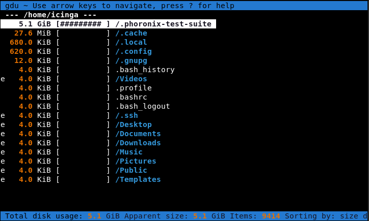

summary: BITI IPM Lab - Disk
id: biti-ipm-disk-linux-lab
categories: linux
tags: ipm, disk, BITI, introduction
status: Published
authors: Roland Pellegrini

# BITI IPM Lab - Disk

<!-- ------------------------ -->

## Before You Begin

### What You’ll Learn

In this codelab you will learn

- how to get information about the internal disk.
- how to monitor the disk with Linux tools.
- how to perform a test run.

### Where You Can Look Up

The **man** is a short term for manual page and acts as an interface to view the reference manual of a command.

Syntax of man:

```
man [option(s)] keyword(s)
```

For example, if you want to find out more about the command **ps** and how to use it, just open a shell and type:

```
man ps
```

This command will display all the information about **ps**.

```
PS(1)                            User Commands                           PS(1)

NAME
       ps - report a snapshot of the current processes.

SYNOPSIS
       ps [options]

DESCRIPTION
       ps displays information about a selection of the active processes.  If
       you want a repetitive update of the selection and the displayed
       information, use top(1) instead.
...
...
```

### What You'll need

#### Guest operation system (Guest OS)

This is the OS of the virtual machine. This will be Debian .

#### Administators privileges

By default, administrator privileges are required on the Host OS to install additional software. Make sure that you have the required permissions.

For the Guest OS, you will create and manage your own users. These users will therefore be different from the Host's user administration.

## Disk Information

### What You will learn:

You can use one of the following commands to find detailed information about the pyhsical or virtual disks on Linux:

- lshw
- inxi
- smartctl

## lshw

### Description

The **lshw** (Hardware Lister) is a simple, yet full-featured tool that provides detailed information on the hardware configuration. It can report memory configuration, mainboard configuration, CPU version and speed, Hard disk drive details, cache configuration, bus speed and a lot more. **lshw** requires root privileges.

Open a shell and run the following command:

```
sudo lshw -class disk
```

Here is a sample output:

```
root@server:~# lshw -class disk
  *-cdrom
       description: DVD reader
       product: CD-ROM
       vendor: VBOX
       physical id: 0.0.0
       bus info: scsi@2:0.0.0
       logical name: /dev/cdrom
       logical name: /dev/dvd
       logical name: /dev/sr0
       version: 1.0
       capabilities: removable audio dvd
       configuration: ansiversion=5 status=ready
     *-medium
          physical id: 0
          logical name: /dev/cdrom
  *-disk
       description: ATA Disk
       product: VBOX HARDDISK
       vendor: VirtualBox
       physical id: 0.0.0
       bus info: scsi@1:0.0.0
       logical name: /dev/sda
       version: 1.0
       serial: VB7b3622bd-ddc6a90c
       size: 24GiB (25GB)
       capabilities: partitioned partitioned:dos
       configuration: ansiversion=5 logicalsectorsize=512 sectorsize=512 signature=826474aa
```

<aside class="positive">
The lshw tool provides also some information about memory or cpu in a very user-friendly format. Consult the documentation and man-pages for more details. However, try to identify keywords and details of the disk and other components in this lab. 
</aside>

To display only the name of the disks, run:

```
root@server:~# lshw -short -class disk
```

The `-short` option is useful when you need the name of the drives only (here: /dev/cdrom or /dev/sda).

Sample output:

```
H/W path            Device      Class       Description
=======================================================
/0/100/1.1/0.0.0    /dev/cdrom  disk        CD-ROM
/0/100/1.1/0.0.0/0  /dev/cdrom  disk
/0/100/d/0.0.0      /dev/sda    disk        25GB VBOX HARDDISK
```

### References

Help needed? Use manual page:

```
man lshw
```

## inxi

### Description

**Inxi** is yet another full-featured command line system information tool. It shows system hardware, CPU, drivers, Xorg, Desktop, Kernel, GCC version(s), Processes, RAM usage, and a wide variety of other useful information.

### Sample code

To get the details of the installed hard disk drives in your Linux system, run the following command:

```
inxi -D
```

Information is grouped per memory device. That means that every memory device is listed separately and various details about the memory are included in the description.

Sample output:

```
root@server:~# inxi -D
Drives:    Local Storage: total: 24 GiB used: 13.57 GiB (56.5%)
           ID-1: /dev/sda vendor: VirtualBox model: VBOX HARDDISK size: 24 GiB
```

<aside class="positive">
Consult the documentation and man-pages for more details. Try to identify keywords and details of the disk. 
</aside>

You can also display more disk details like disk controller speed, serial no and temperature using the following command:

```
inxi -Dxx
```

Sample output:

```
Drives:    Local Storage: total: 24 GiB used: 13.57 GiB (56.5%)
           ID-1: /dev/sda vendor: VirtualBox model: VBOX HARDDISK size: 24 GiB speed: 3.0 Gb/s serial: VB7b3622bd-ddc6a90c
```

<aside class="positive">
Be aware that all commands are executed within a virtual machine. Running the tool on physical hardware provides more information. 
</aside>

### References

Read the manual to find out more:

```
man inxi
```

## smartctl

### Description

**Smartclt** is a command line, control and monitor utility for SMART disks. It controls the **S**elf-**M**onitoring, **A**nalysis and **R**eporting **T**echnology (SMART) system built into most ATA/SATA and SCSI/SAS hard drives and solid-state drives.

**Smartclt** command is part of the **smartmontools** package, which comes pre-installed in most Linux versions.
**Smartclt** requires root privileges.

### Sample code

To get all details about the first hard disk drive (dev/sda) in your Linux box, run **Smartclt** the following options:

```
sudo smartctl -d ata -a -i /dev/sda
```

Sample output:

```
smartctl 6.6 2017-11-05 r4594 [x86_64-linux-4.19.0-17-amd64] (local build)
Copyright (C) 2002-17, Bruce Allen, Christian Franke, www.smartmontools.org

=== START OF INFORMATION SECTION ===
Device Model:     JAJS600M512C
Serial Number:    30013687674
Firmware Version: S0222A0
User Capacity:    512,110,190,592 bytes [512 GB]
Sector Size:      512 bytes logical/physical
Rotation Rate:    Solid State Device
Form Factor:      2.5 inches
Device is:        Not in smartctl database [for details use: -P showall]
ATA Version is:   ACS-2 T13/2015-D revision 3
SATA Version is:  SATA 3.2, 6.0 Gb/s (current: 6.0 Gb/s)
Local Time is:    Tue Oct 12 21:42:16 2021 CEST
SMART support is: Available - device has SMART capability.
SMART support is: Enabled

=== START OF READ SMART DATA SECTION ===
SMART overall-health self-assessment test result: PASSED

General SMART Values:
Offline data collection status:  (0x00)	Offline data collection activity
					was never started.
					Auto Offline Data Collection: Disabled.
Self-test execution status:      (   0)	The previous self-test routine completed
					without error or no self-test has ever
					been run.
Total time to complete Offline
data collection: 		(  120) seconds.
Offline data collection
capabilities: 			 (0x11) SMART execute Offline immediate.
					No Auto Offline data collection support.
					Suspend Offline collection upon new
					command.
					No Offline surface scan supported.
					Self-test supported.
					No Conveyance Self-test supported.
					No Selective Self-test supported.
SMART capabilities:            (0x0002)	Does not save SMART data before
					entering power-saving mode.
					Supports SMART auto save timer.
Error logging capability:        (0x01)	Error logging supported.
					General Purpose Logging supported.
Short self-test routine
recommended polling time: 	 (   2) minutes.
Extended self-test routine
recommended polling time: 	 (  10) minutes.

SMART Attributes Data Structure revision number: 1
Vendor Specific SMART Attributes with Thresholds:
ID# ATTRIBUTE_NAME          FLAG     VALUE WORST THRESH TYPE      UPDATED  WHEN_FAILED RAW_VALUE
  1 Raw_Read_Error_Rate     0x0032   100   100   050    Old_age   Always       -       0
  5 Reallocated_Sector_Ct   0x0032   100   100   050    Old_age   Always       -       0
  9 Power_On_Hours          0x0032   100   100   050    Old_age   Always       -       7576
 12 Power_Cycle_Count       0x0032   100   100   050    Old_age   Always       -       385
160 Unknown_Attribute       0x0032   100   100   050    Old_age   Always       -       0
161 Unknown_Attribute       0x0033   100   100   050    Pre-fail  Always       -       100
163 Unknown_Attribute       0x0032   100   100   050    Old_age   Always       -       9
164 Unknown_Attribute       0x0032   100   100   050    Old_age   Always       -       42090
165 Unknown_Attribute       0x0032   100   100   050    Old_age   Always       -       128
166 Unknown_Attribute       0x0032   100   100   050    Old_age   Always       -       10
167 Unknown_Attribute       0x0032   100   100   050    Old_age   Always       -       85
168 Unknown_Attribute       0x0032   100   100   050    Old_age   Always       -       7000
169 Unknown_Attribute       0x0032   100   100   050    Old_age   Always       -       99
175 Program_Fail_Count_Chip 0x0032   100   100   050    Old_age   Always       -       0
176 Erase_Fail_Count_Chip   0x0032   100   100   050    Old_age   Always       -       0
177 Wear_Leveling_Count     0x0032   100   100   050    Old_age   Always       -       0
178 Used_Rsvd_Blk_Cnt_Chip  0x0032   100   100   050    Old_age   Always       -       0
181 Program_Fail_Cnt_Total  0x0032   100   100   050    Old_age   Always       -       0
182 Erase_Fail_Count_Total  0x0032   100   100   050    Old_age   Always       -       0
192 Power-Off_Retract_Count 0x0032   100   100   050    Old_age   Always       -       20
194 Temperature_Celsius     0x0022   100   100   050    Old_age   Always       -       40
195 Hardware_ECC_Recovered  0x0032   100   100   050    Old_age   Always       -       824
196 Reallocated_Event_Count 0x0032   100   100   050    Old_age   Always       -       0
197 Current_Pending_Sector  0x0032   100   100   050    Old_age   Always       -       0
198 Offline_Uncorrectable   0x0032   100   100   050    Old_age   Always       -       0
199 UDMA_CRC_Error_Count    0x0032   100   100   050    Old_age   Always       -       0
232 Available_Reservd_Space 0x0032   100   100   050    Old_age   Always       -       100
241 Total_LBAs_Written      0x0030   100   100   050    Old_age   Offline      -       232859
242 Total_LBAs_Read         0x0030   100   100   050    Old_age   Offline      -       490349
245 Unknown_Attribute       0x0032   100   100   050    Old_age   Always       -       686052

SMART Error Log Version: 1
No Errors Logged

SMART Self-test log structure revision number 1
No self-tests have been logged.  [To run self-tests, use: smartctl -t]

Selective Self-tests/Logging not supported
```

Here is a short list of SMART attributes:

- **Read Error Rate** - Non-correctable errors when reading from the hard disk, leads to re-reading.
- **Throughput Performance** - data throughput or efficiency of the hard disk drive.
- **Power On Hours** - Uptime in hours or seconds (including standby).
- **Temperature** - Temperature of the drive in °C.
- **Power Cycle Count** - Indicates how many times the drive has been turned on and off.
- **Hardware ECC Recovered** - corrected bit errors during reading.
- **Total LBAs Written** - The total number of sectors written by the host system.

### References

Reading the manual pages may answer open questions:

```
man smartctl
```

## Disk Space

### What You will learn:

You can use one of the following commands to find detailed information about the disk usage on Linux:

- df
- gdu

## df

### Description

Linux has a strong built-in utility called `df`. The `df` command stands for “disk filesystem“, it is used to get a full summary of available and used disk space usage of the file system on the Linux system.

### Sample code

To run `df`, just open a terminal and run:

```
df
```

Using `-h` parameter with (df -h) will show the file system disk space statistics in “human-readable” format, means it gives the details in bytes, megabytes, and gigabyte.

```
df -h
```

### Sample output

When running `df -h`, you can see the following output.

```
Filesystem                     Size  Used Avail Use% Mounted on
udev                           1.8G     0  1.8G   0% /dev
tmpfs                          394M  1.2M  393G   1% /run
/dev/sda1                       31G   12G   18G  41% /
tmpfs                          2.0G  143M  2.0G   0% /dev/shm
tmpfs                          5.0M  4.0K  5.0M   1% /run/lock
tmpfs                          394M  112K  394G   1% /run/user/1000
```

As can be seen in the output, the device `/dev/sda1` uses 12G of 31G of space.

<aside class="positive">
Consult the documentation and man pages for more details. Try to identify keywords and details not only of the memory, but also the details about processes, I/O and more. 
</aside>

### References

Reading the manual pages may answer open questions:

```
man df
```

## gdu

### Description

The tool `gdu` is a pretty fast disk usage analyzer written in Go. It is intended primarily for SSD disks where it can fully utilize parallel processing. However, HDDs work as well, but the performance gain is not so huge.

### Sample code

If you run the `gdu` command without passing any argument it will scan your current working directory. To run gdu, just open a terminal and run:

```
gdu
```

If you want to know the arguments, just run the following:

```
gdu -h
```

### Sample output

When running gdu, you can see from the below image the home directory is scanned sorted by size:



Use the arrow keys to move up and down in the directory tree. Press `Enter` to move to a subdirectory. If you want to leave the subdirectory, move the cursor up to `...` and press `Enter`.

There are few operations you can perform with the gdu command. Press `?` to access help.


### References

Reading the manual pages may answer open questions:

```
man gdu
```

## Disk monitoring

### What You will learn:

You can use one of the following command to monitor disks on Linux:

- iotop
- dstat

## iotop

### Description

**iotop** is a top-like utility for displaying real-time disk activity. By using **iotop** command, you can monitor the disk utilization by individual processes.

### Sample code

Here is a quick example:

```
iotop -o
```

The `-o` or `--only` option presents only processes or threads actually doing I/O.

Sample output:


The **iotop** command displays columns for the I/O bandwidth read and written by each process/thread during the sampling period. It also displays the percentage of time the thread/process spent while swapping in and while waiting on I/O. For each process, its I/O priority (class/level) is shown. In addition, the total I/O bandwidth read and written during the sampling period is displayed at the top of the interface.

<aside class="positive">
Consult the documentation and man-pages for more details. 
</aside>

### References

Don't blame it on the manual:

```
man iotop
```

## dstat

### Description

The **dstat** tool is used to retrieve information or statistics form components of the system such as network connections, IO devices, or CPU. By using this tool a system administrator can even see the throughput for block devices that make up a single filesystem or storage system.

### Sample code

Open a shell and run **dstat** without any option to see major OS components:

```
dstat
```

Sample output:

```
root@server:~# dstat
You did not select any stats, using -cdngy by default.
--total-cpu-usage-- -dsk/total- -net/total- ---paging-- ---system--
usr sys idl wai stl| read  writ| recv  send|  in   out | int   csw
  1   0  99   0   0|  54k  265k|   0     0 |   0     0 | 189    80
  4   0  96   0   0|   0     0 |   0     0 |   0     0 | 254   228
  5   1  94   0   0|   0   124k|   0     0 |   0     0 | 523   589
  4   1  95   0   0|   0     0 |   0     0 |   0     0 | 317   252
  3   1  96   0   0|   0     0 |   0     0 |   0     0 | 331   334
  4   1  96   0   0|   0     0 |   0     0 |   0     0 | 303   282
  5   1  95   0   0|   0     0 |   0     0 |   0     0 | 284   269
  4   1  95   0   0|   0     0 |   0     0 |   0     0 | 267   238
  4   0  96   0   0|   0     0 |   0     0 |   0     0 | 283   246
  3   1  97   0   0|   0     0 |   0     0 |   0     0 | 247   181
  5   0  95   0   0|   0     0 |   0     0 |   0     0 | 515   646
  4   0  96   0   0|   0     0 |   0     0 |   0     0 | 312   242
  4   1  96   0   0|   0   280k|   0     0 |   0     0 | 355   276
  4   1  96   0   0|   0     0 |   0     0 |   0     0 | 316   241
```

This command will display CPU, Disk, Network, Paging and System stats.
The output above indicates:

- CPU stats: cpu usage by a user (usr) processes, system (sys) processes, as well as the number of idle (idl) and waiting (wai) processes, hard interrupt (hiq) and soft interrupt (siq).
- Disk stats: total number of read (read) and write (writ) operations on disks.
- Network stats: total amount of bytes received (recv) and sent (send) on network interfaces.
- Paging stats: number of times information is copied into (in) and moved out (out) of memory.
- System stats: number of interrupts (int) and context switches (csw). A CSW is a process that involves switching of the CPU from one process or task to another.

<aside class="positive">
Consult the documentation and man pages for more details. Try to identify keywords and details not only of the memory, but also the details about processes, I/O and more. 
</aside>

Additionally, you can also store the output of dstat in a CSV file for analysis at a latter time by enabling the `--output` option.

By running **dstat** with the following options, we are displaying the time, cpu, mem, disk, and system load statistics with a one second delay between 5 updates (counts).

```
dstat --time --cpu --mem disk --load --output report.csv 1 5
```

Sample output:

```
----system---- --total-cpu-usage-- ------memory-usage----- -dsk/total- ---load-avg---
     time     |usr sys idl wai stl| used  free  buff  cach| read  writ| 1m   5m  15m
12-10 23:17:49|  1   1  99   0   0| 704M 2957M 5680k  254M| 115k  413k|1.91 0.57 0.20
12-10 23:17:50| 19   5  68   9   0| 718M 2931M 6012k  266M|  12M   56k|1.91 0.57 0.20
12-10 23:17:51|  6   2  90   2   0| 718M 2928M 6012k  269M|2448k    0 |1.91 0.57 0.20
12-10 23:17:52|  3   1  96   0   0| 718M 2928M 6012k  269M|   0     0 |1.91 0.57 0.20
12-10 23:17:53|  7  42  50   0   0| 721M 3030M 6016k  169M| 176k    0 |1.91 0.57 0.20
12-10 23:17:54| 10  52  39   0   0| 721M 2964M 6016k  233M|   0   300k|1.84 0.58 0.21
12-10 23:17:55|  5  47  34  14   0| 719M 2896M 6104k  300M|1140k  308k|1.84 0.58 0.21
12-10 23:17:56|  3  48  49   0   0| 720M 2825M 6104k  370M|   0     0 |1.84 0.58 0.21
12-10 23:17:57|  3  44  38  15   0| 720M 2754M 6104k  438M|   0  4820k|1.84 0.58 0.21
12-10 23:17:58|  7  47   0  46   0| 720M 2687M 6104k  504M|   0  7428k|1.84 0.58 0.21
12-10 23:17:59|  4  48   0  49   0| 720M 2615M 6104k  574M|   0  9320k|1.85 0.60 0.22
12-10 23:18:00| 12  43   1  44   0| 719M 2560M 6120k  628M|  92k  113M|1.85 0.60 0.22
```

### Bug fixing

The program may have a bug in the Python3 CSV library. This causes the following error:

```
NameError: name 'types' is not defined
```

To fix this error, you have to change the type-checking function on lines 547 & 552. 
- Open a terminal as root.
- Edit the file /usr/bin/dstat with an editor of your choice.
- Go to line 547 and 552.
- The code before:
```
if isinstance(self.val[name], types.ListType) or isinstance(self.val[name], types.TupleType):
    for j, val in enumerate(self.val[name]):
        line = line + printcsv(val)
        if j + 1 != len(self.val[name]):
            line = line + char['sep']
elif isinstance(self.val[name], types.StringType):
```
- The code afterwards:
```
if isinstance(self.val[name], (tuple, list)):
    for j, val in enumerate(self.val[name]):
        line = line + printcsv(val)
        if j + 1 != len(self.val[name]):
            line = line + char['sep']
elif isinstance(self.val[name], str):
```
- Save the file and run the **dstat** command again. Fixed.

### References

Not enought? Read the manual:

```
man dstat
```

Bug fix:
Click [here](https://serverfault.com/questions/996996/dstat-fails-to-start-trying-to-load-python3s-csv) to read the story.

## Hands-on

### What you will learn:

In this codelab, you will learn

- how to use the dstat tool
- how to generate workload
- how to create a report file

### What you will need:

In this codelab, you will need the following tools:

- dstat
- stress

Details of the **stress** tool can be found in the corresponding Codelab named `BITI IPM Lab - Stress (Linux)`.

### Scenario

In this codelab, the GuestOS is a Virtual Machine with 2 CPU Cores and 4 GB RAM. The GuestOS is based on Debian with Linux kernel version 5.10.0-8-amd64. The VM is installed and running on the Linux-based Hypervisor VirtualBox, Version 6.1.16 r140961 (QT 5.11.3). THe HostOS is based on Debian with Linux Kernel version 4.19.0-17-amd64. The Host hardware is HP Prodesk 400 G1 DN with a Intel Core i3-4160T CPU@3.10GHz, 16GB RAM, and an Intenso SATA III Top 512GB.

### Test Run

- Open a shell terminal and execute the following command:

```
dstat --time --cpu --mem disk --load --output report.csv 1 5
```

- Open the second shell terminal and start the workload generator with the following options.

```
stress --hdd 2 --io 4 --vm 6 --cpu 8 --timeout 30s
```

Where,

- **--hdd 2** - This will start a 2-thread test, which will write data to the storage and delete it.
- **--io 4** - This will start a 4-thread test, which will stress the system' storage read and write buffers.
- **--vm 6** - This will start a 6-thread test, running malloc() and free() functions.
- **--cpu 4** - This will start a 8-thread test, running sqrt()) functions.

Notice that the workload generator runs with a time limit of 30 seconds. Afterwards, open the report.csv file and analyse the results within your team.

Sample output:

```
----system---- --total-cpu-usage-- ------memory-usage----- -dsk/total- ---load-avg---
     time     |usr sys idl wai stl| used  free  buff  cach| read  writ| 1m   5m  15m
12-10 23:23:28|  1   1  98   0   0|1709M  126M 7208k 2031M| 117k  579k|1.37 0.55 0.28
12-10 23:23:29| 24  76   0   0   0|1449M  497M 7172k 1922M|  16k  323M|1.37 0.55 0.28
12-10 23:23:30| 23  77   0   0   0|1512M 1527M 7188k  860M|4096B  183M|2.54 0.80 0.36
12-10 23:23:31| 11  40  24  24   0| 720M 2227M 7188k  949M| 444k   11M|2.54 0.80 0.36
12-10 23:23:32|  2   1  49  49   0| 720M 2227M 7188k  949M| 248k 7340k|2.54 0.80 0.36
12-10 23:23:33|  1   0  49  50   0| 720M 2227M 7188k  949M|  72k 8156k|2.54 0.80 0.36
12-10 23:23:34|  3   1  49  48   0| 720M 2227M 7188k  949M|4096B 6520k|2.54 0.80 0.36
12-10 23:23:35|  4   1  47  49   0| 720M 2227M 7188k  949M|   0  9812k|2.82 0.89 0.39
12-10 23:23:36|  3   1  48  49   0| 720M 2227M 7188k  949M|   0    11M|2.82 0.89 0.39
12-10 23:23:37|  4   1   4  91   0| 720M 2227M 7200k  949M|   0  7336k|2.82 0.89 0.39
12-10 23:23:38|  5   2  43  51   0| 718M 2555M 7212k  631M|8192B 4944k|2.82 0.89 0.39
12-10 23:23:39| 10   2  84   4   0| 718M 2550M 7356k  636M|5692k    0 |2.82 0.89 0.39
12-10 23:23:40|  5   1  95   0   0| 718M 2550M 7356k  636M|   0     0 |2.75 0.91 0.40
12-10 23:23:41|  8   2  90   0   0| 718M 2550M 7356k  636M|   0     0 |2.75 0.91 0.40
12-10 23:23:42|  3   0  97   0   0| 718M 2550M 7356k  636M|   0     0 |2.75 0.91 0.40
12-10 23:23:43| 21  65  14   0   0|1774M 1166M 7364k  956M|8192B   13M|2.75 0.91 0.40
12-10 23:23:44| 23  77   0   0   0|1230M 1542M 6976k 1120M|   0    18M|2.75 0.91 0.40
12-10 23:23:45| 24  76   0   0   0|1599M 1133M 6976k 1159M|   0    15M|3.98 1.19 0.50
12-10 23:23:46| 24  76   0   0   0|1495M 1225M 6976k 1171M|   0    18M|3.98 1.19 0.50
12-10 23:23:47| 23  77   0   0   0|1425M 1287M 6976k 1178M|   0    19M|3.98 1.19 0.50
12-10 23:23:48| 24  76   0   0   0|1494M 1208M 6988k 1188M|   0    21M|3.98 1.19 0.50
12-10 23:23:49| 26  74   0   0   0|1544M 1147M 6988k 1199M|   0    18M|3.98 1.19 0.50
12-10 23:23:50| 23  77   0   0   0|1470M 1209M 6988k 1211M|   0    12M|5.02 1.46 0.59
12-10 23:23:51| 25  75   0   0   0|1538M 1094M 6988k 1256M|   0   177M|5.02 1.46 0.59
12-10 23:23:52| 22  78   0   0   0|1647M  746M 7004k 1489M|8192B  298M|5.02 1.46 0.59
12-10 23:23:53|  8  20  71   0   0| 719M 2560M 7020k  626M|   0    73M|5.02 1.46 0.59
12-10 23:23:54|  5   1  95   0   0| 719M 2560M 7020k  626M|   0     0 |5.02 1.46 0.59
12-10 23:23:55|  4   0  96   0   0| 719M 2560M 7020k  626M|   0     0 |4.70 1.45 0.59
12-10 23:23:56|  4   0  96   0   0| 719M 2560M 7020k  626M|   0     0 |4.70 1.45 0.59
12-10 23:23:57|  5   0  95   0   0| 719M 2560M 7020k  626M|   0     0 |4.70 1.45 0.59
12-10 23:23:58|  4   0  87   9   0| 719M 2560M 7032k  626M|   0    64k|4.70 1.45 0.59
12-10 23:23:59|  4   0  96   0   0| 719M 2560M 7032k  626M|   0     0 |4.70 1.45 0.59
12-10 23:24:00|  4   1  95   0   0| 719M 2560M 7032k  626M|   0     0 |4.32 1.42 0.59
```

### Clean Up

- To clean up, delete the report file.

This is the end of the hands-on.
