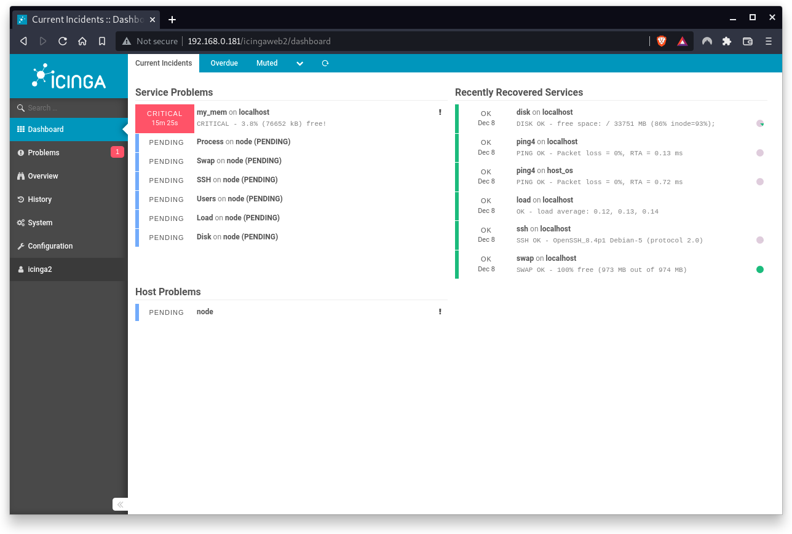
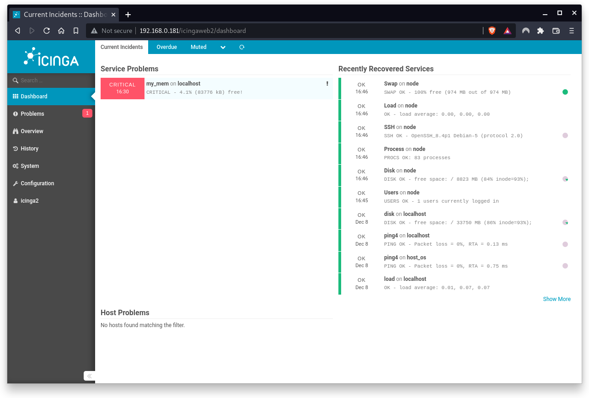
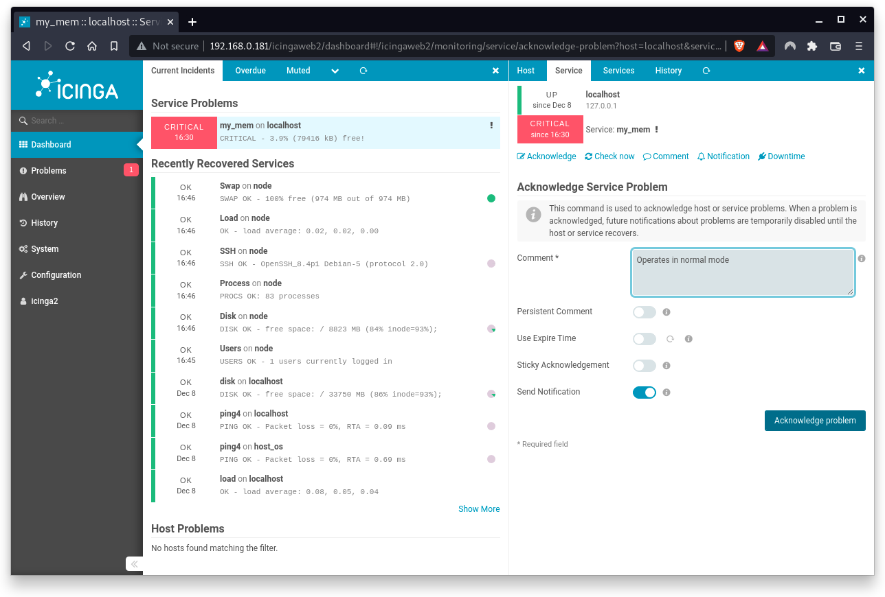

summary: BITI IPM Lab - Icinga Agentbased Monitoring
id: biti-ipm-icinga-agentbased-lab
categories: icinga
tags: ipm, icinga, BITI, introduction
status: Draft
authors: Roland Pellegrini

# BITI IPM Lab - Icinga Agentbased Monitoring

<!-- ------------------------ -->

## Before You Begin

### What You’ll Learn

Hosts and services can be monitored in two ways:

- **Usage of Simple Host Monitoring (Agentless):** This method is used for monitoring hosts where monitoring agents cannot be installed.

- **Usage of Monitoring Agents (Agentbased):** This method is used where agents are required. In this use case, Icinga 2 acts as the master node while the remote host serves as the client node.

In this codelab you will learn

- how to monitor the availability of remote hosts and services with Icinga2 agents.

Hosts and services can be anything such as Network services (HTTP, SSH, etc.), printers, switches or routers, or any other local or network-accessible services. Icinga2 monitors the states of hosts and the services they offer. Each host can have the states UP and DOWN, each service can have the states OKAY, WARNING, CRITICAL and UKNOWN.

### Where You Can Look Up

The best source of documentation is the homepage of Icinga2. The latest documentation can be found [here](https://icinga.com/docs/icinga-2/latest/doc/01-about/).

### What You'll need

#### Icinga2 instances

In this codelab you will need two virtual machines:

1. A working Icinga2 Core instance (called server) that you can access via IcingaWeb2 GUI.

2. A working Debian instance (called client) where Icinga2 Agent software ist installed for remote monitoring.

Both virtual machines run under Debian, but the specification of the node instance differs from the server instance. Firstly, the Node instance has no graphical user interface, all commands must be executed via the console. Secondly, the hardware is limited to 1 CPU core with 1 GB Ram to ensure that your HostOS (= your laptop) continues to function without any problems.

#### Guest operation system (Guest OS)

This is the OS of the virtual machine. This will be Debian.

#### Administators privileges

By default, administrator privileges are required on the Host OS to install additional software. Make sure that you have the required permissions.

For the Guest OS, you will create and manage your own users. These users will therefore be different from the Host's user administration.

### Root privileges via sudo

In this codelab you have to work with root privileges. Therefore, a few words of caution: double check whatever you type and make backups whenever necessary.

Working with root privileges is quite easy. Open a terminal (a shell) and enter the following commmand:

```
sudo -s
```

Enter the password of the icinga user and voila:

```
root@server:/home/icinga#
```

Once you are root via sudo, it is no longer necessary to use the `sudo` command. Instead of `sudo ls -lisa /root/` you can also type `ls -lisa /root/` because you have already root privileges. However, all commands will always start with `sudo` to remind you that you are working with root privileges.

<!-- ------------------------ -->


## Something really important

### Test your environment 

<aside class="negative">
This lab requires a working network environment.
</aside>


Before you start this lab, first check the network connection between **ipm-server** and **ipm-client** with a simple `ping` (from both sides). If one of the two nodes cannot be reached from the other node, stop here and fix your environment before continuing this lab.

### Server and Node
In this lab the following IP addresses are used:

- 192.168.0.115 - server node (ipm-server or server)
- 192.168.0.125 - cliend node (ipm-client or client)

Please don't mix them up.

## Icinga2 server node

### Set up Icinga2 server node

<aside class="negative">
Warning: Please follow the next instructions very carefully. If you make a typo or a wrong selection, the setup will complete but the server node will not work properly. So please double-check your inputs. In case of typos or resulting errors, the best and most effective way to fix any issue is to delete / remove the virtual machine and start from scratch. Fixing the errors in configuration files is a more time-consuming task at weekends.
</aside>

First, we will start to set up the Icinga2 server as a master node.

Run the following command on your server to setup a Icinga2 master node:

```
sudo icinga2 node wizard
```

This will prompt you the Setup Wizard and follow the instructions.

```
Welcome to the Icinga 2 Setup Wizard!

We will guide you through all required configuration details.

Please specify if this is an agent/satellite setup ('n' installs a master setup) [Y/n]: n <<<--- ENTER THIS

Starting the Master setup routine...

Please specify the common name (CN) [ipm-server]: <<<--- PRESS ENTER
Reconfiguring Icinga...
Checking for existing certificates for common name 'ipm-server'...
Certificates not yet generated. Running 'api setup' now.
Generating master configuration for Icinga 2.
Enabling feature api. Make sure to restart Icinga 2 for these changes to take effect.

Master zone name [master]: <<<--- PRESS ENTER

Default global zones: global-templates director-global
Do you want to specify additional global zones? [y/N]: <<<--- PRESS ENTER
Please specify the API bind host/port (optional):
Bind Host []: <<<--- PRESS ENTER
Bind Port []: <<<--- PRESS ENTER

Do you want to disable the inclusion of the conf.d directory [Y/n]: n <<<--- ENTER THIS

Done.

Now restart your Icinga 2 daemon to finish the installation!
```

When done, run the following command to restart the Icinga2 service. This will finalize the setup.

```
sudo systemctl restart icinga2
```

<aside class="negative">
Yeap, restart Icinga2 here otherwise you get into troubles later. 
</aside>

### Set up the firewall on Icinga2 server node

If a firewall is running on your server node, you have to open the following port. This enables the communication between server and client nodes.

```
sudo ufw allow 5665
sudo ufw reload
```

<aside class="negative">
Disabling the firewall is not recommended on production systems.
</aside>

If you receive the error message "ufw: command not found", install the missing package `ufw` on your system. 
```
sudo apt update
sudo apt install ufw
```
Next, allow incoming and outgoing traffic:

```
sudo ufw allow 5665
sudo ufw reload
```


### Generate a client ticket

A client (=Icinga2 satellite) that sends a Certificate Signing Request (CSR) must authenticate itself in a trustworthy manner. The master generates a client ticket that is part in this request. The master can use this ticket to check whether the request matches the previously trusted ticket and sign the request.

Run the commands below on the master node to generate the ticket for your client node:

```
icinga2 pki ticket --cn 'ipm-client'
```

Sample output of a ticket:

```
3bcb8a06466706f6a5d5f541c175004149e6dbb2
```
<aside class="negative">
Save this ticket key as you will need it later again.
</aside>

If no errors occur, skip the next chapter, **scroll down** and continue with the chapter called **Listen on port 5665**.

### Fix the salt problem

<aside class="negative">
Follow this chapter if you encounter problems creating the PKI Ticket. If you have successfully created a ticket previously, please ignore this chapter. 
</aside>

When you create a PKI ticket you may get the following error:

```
critical/cli: Ticket salt (--salt) must be specified
```

This is bad news, we need to fix this.

First, restart the Icinga2 service.

```
sudo systemctl restart icinga2
```

Next, you have to check if icinga2 has generated a so-called **TicketSalt**. This is a global value  and stored in the directory `/etc/icinga2/constants.conf`. 

You can check the content of this file with the following command:

```
sudo cat /etc/icinga2/constants.conf
```

The TicketSalt can be found in the last line of the output:

```
/**
 * This file defines global constants which can be used in
 * the other configuration files.
 */

/* The directory which contains the plugins from the Monitoring Plugins project. */
const PluginDir = "/usr/lib/nagios/plugins"

/* The directory which contains the Manubulon plugins.
 * Check the documentation, chapter "SNMP Manubulon Plugin Check Commands", for details.
 */
const ManubulonPluginDir = "/usr/lib/nagios/plugins"

/* The directory which you use to store additional plugins which ITL provides user contributed command definitions for.
 * Check the documentation, chapter "Plugins Contribution", for details.
 */
const PluginContribDir = "/usr/lib/nagios/plugins"

/* Our local instance name. By default this is the server's hostname as returned by `hostname --fqdn`.
 * This should be the common name from the API certificate.
 */
const NodeName = "server"

/* Our local zone name. */
const ZoneName = "master"

/* Secret key for remote node tickets */
const TicketSalt = "aca0ab61458ee407a3e95da9cf9c90d3"
```

<aside class="negative">
In cryptography, a salt is a set of random bits that are used as one of the inputs for a key derivation function. The other input is usually a password or a passphrase. The output of the key derivation function is stored as an encrypted version of the password. 
</aside>

Now run the following command by using the TicketSalt as parameter:

```
icinga2 pki ticket --cn 'node' --salt 'aca0ab61458ee407a3e95da9cf9c90d3'
3bcb8a06466706f6a5d5f541c175004149e6dbb2
```

Save this key now, as you will need it later when setting up the client nodes. However, if you get an error again, contact your instructor for help.

### Listen on port 5665

Before you can set up the client nodes, make sure that Icinga 2 is set up and running on the master node. Furthermore, make sure that the master node accepts incoming traffic on port 5665/tcp.

Run the following command to check the status:

```
ss -altnp | grep 5665
```

Sample output of the **socket statistic** command:

```
LISTEN 0 4096 0.0.0.0:5665 0.0.0.0:* users:(("icinga2",pid=18872,fd=14))
```

Note, that the process id (pid) and the file descriptor (fd) may differ from your output.

<!-- ------------------------ -->

## Icinga2 client node

### Installing Icinga2 on client node

<aside class="positive">
Now we have to do a lot of work on the `node` client. Don't mix it up with the `server` node.
</aside>

Yes, you have to install Icinga2 on the client node again. However, don't worry, the installation will be much shorter, I promise.

### System update

The software repository on Icinga2 node might be outdated. Run the following commands on the node client to update your system package repositories.

```
sudo apt update
sudo apt upgrade
```

<aside class="positive">
When using the sudo command, you will be prompted for your password.
</aside>

Depending on the package upgrades, it is useful to restart the system here.

<!-- ------------------------ -->

### Icinga2 Core App

Now that Icinga 2 repos are available, you can install Icinga core by running the command below:

```
sudo apt install icinga2
```

During installation, the apt command displays the following information.

```
--- more ---
enabling default icinga2 features
Enabling feature checker. Make sure to restart Icinga 2 for these changes to take effect.
Enabling feature notification. Make sure to restart Icinga 2 for these changes to take effect.
Enabling feature mainlog. Make sure to restart Icinga 2 for these changes to take effect.
--- more ---
```

<aside class="positive">
Please do not restart any Icinga2 service here. We will do this later. 
</aside>

On Debian, Icinga2 is started and activated during installation. You can check this by executing the command:

```
systemctl status icinga2
```

Sample output:

```
● icinga2.service - Icinga host/service/network monitoring system
     Loaded: loaded (/lib/systemd/system/icinga2.service; enabled; vendor preset: enabled)
     Active: active (running) since Sat 2021-10-16 12:43:07 CET; 1min 6s ago
       Docs: https://icinga.com/docs/icinga2/latest/
    Process: 2846 ExecStartPre=/usr/lib/icinga2/prepare-dirs /usr/lib/icinga2/icinga2 (code=exited, status=0/SUCCESS)
   Main PID: 2853 (icinga2)
      Tasks: 13 (limit: 1133)
     Memory: 12.5M
        CPU: 1.069s
     CGroup: /system.slice/icinga2.service
             ├─2853 /usr/lib/x86_64-linux-gnu/icinga2/sbin/icinga2 --no-stack-rlimit daemon -e
             ├─2867 /usr/lib/x86_64-linux-gnu/icinga2/sbin/icinga2 --no-stack-rlimit daemon -e
             └─2870 /usr/lib/x86_64-linux-gnu/icinga2/sbin/icinga2 --no-stack-rlimit daemon -e

Oct 16 12:43:07 node icinga2[2867]: [2021-10-16 12:43:07 +0100] information/ConfigItem: Instantiated 235 CheckCommands.
Oct 16 12:43:07 node icinga2[2867]: [2021-10-16 12:43:07 +0100] information/ScriptGlobal: Dumping variables to file '/var/cache/icinga2/icinga2.vars'
Oct 16 12:43:07 node systemd[1]: Started Icinga host/service/network monitoring system.
Oct 16 12:43:07 node icinga2[2867]: [2021-10-16 12:43:07 +0100] information/ConfigItem: Triggering Start signal for config items
Oct 16 12:43:07 node icinga2[2867]: [2021-10-16 12:43:07 +0100] information/FileLogger: 'main-log' started.
Oct 16 12:43:07 node icinga2[2867]: [2021-10-16 12:43:07 +0100] information/NotificationComponent: 'notification' started.
Oct 16 12:43:07 node icinga2[2867]: [2021-10-16 12:43:07 +0100] information/CheckerComponent: 'checker' started.
Oct 16 12:43:07 node icinga2[2867]: [2021-10-16 12:43:07 +0100] information/ConfigItem: Activated all objects.
Oct 16 12:44:07 node icinga2[2867]: [2021-10-16 12:44:07 +0100] information/ConfigObjectUtility: Created and activated object 'node!load!6d89e9ea-7f13-41cb-b566-cd6899af5727' of type 'Downtime'.
Oct 16 12:44:07 node icinga2[2867]: [2021-10-16 12:44:07 +0100] information/Downtime: Added downtime 'node!load!6d89e9ea-7f13-41cb-b566-cd6899af5727' between '2021-10-17 02:00:00' and '2021-10-17 03:00:00', author: 'icingaadmin', fixed
```

Check if the status Active is in **running** mode which indicates that the service is up and running.

### Monitoring Plugins

Icinga 2 also requires additional monitoring plugins to check external services. Execute the command below to install the plugins:

```
sudo apt install monitoring-plugins
```

<aside class="positive">
The command above will install a lot of Nagios-plugins. Remember the origin of Icinga.
</aside>

### Restart the service

After installing additional monitoring-plugins, it is a always idea to restart the Icinga2 service and to check its status.

```
systemctl restart icinga2
systemctl status icinga2
```

### Set up Icinga2 client node

<aside class="negative">
Warning: Please follow the next instructions very carefully. If you make a typo or a wrong selection, the setup will complete but the server node will not work properly. So please double-check your inputs. In case of typos or resulting errors, the best and most effective way to fix any issue is to delete / remove the virtual machine and start from scratch. Fixing the errors in configuration files is a more time-consuming task at weekends.
</aside>

In the last section, we set up the Icinga2 master node. In this section, we need to set up the Icinga2 agent node which

- receives and accepts configurations and CheckCommands from the master node,
- executes CheckCommands from the master node,
- monitors the host where the agent is installed,
- and which report the CheckCommand results back to the master node.

Run the following command on your client to setup the Icinga2 agent node:

```
sudo icinga2 node wizard
```


This will prompt you if this is a Satellite or Client setup. Choose **Y** to select an agent setup:

```
Welcome to the Icinga 2 Setup Wizard!

We will guide you through all required configuration details.

Please specify if this is an agent/satellite setup ('n' installs a master setup) [Y/n]: <<<--- PRESS ENTER

Starting the Agent/Satellite setup routine...

Please specify the common name (CN) [ipm-client]: <<<--- PRESS ENTER

Please specify the parent endpoint(s) (master or satellite) where this node should connect to:
Master/Satellite Common Name (CN from your master/satellite node): ipm-server <<<--- ENTER THIS

Do you want to establish a connection to the parent node from this node? [Y/n]: <<<--- PRESS ENTER
Please specify the master/satellite connection information:
Master/Satellite endpoint host (IP address or FQDN): 192.168.0.115 <<<--- ENTER THE IP OF YOUR ICINGA2 MASTER NODE
Master/Satellite endpoint port [5665]: <<<--- PRESS ENTER

Add more master/satellite endpoints? [y/N]: <<<--- PRESS ENTER
Parent certificate information:

 Version:             3
 Subject:             CN = ipm-server
 Issuer:              CN = Icinga CA
 Valid From:          Dec 15 22:32:54 2021 GMT
 Valid Until:         Dec 11 22:32:54 2036 GMT
 Serial:              ee:e1:e8:f4:89:72:54:78:33:7e:44:fe:2a:49:f2:2a:21:02:71:b8

 Signature Algorithm: sha256WithRSAEncryption
 Subject Alt Names:   ipm-server
 Fingerprint:         B6 53 F1 17 35 84 35 B3 B3 DE 36 82 4F F9 BC B5 13 75 50 44 E1 40 11 7C 3D F9 A1 78 7C 2A 03 48

Is this information correct? [y/N]: y <<<--- ENTER THIS

Please specify the request ticket generated on your Icinga 2 master (optional).
 (Hint: # icinga2 pki ticket --cn 'ipm-client'): 3bcb8a06466706f6a5d5f541c175004149e6dbb2 <<<--- ENTER THIS AS DESCRIBED IN SECTION BEFORE
Please specify the API bind host/port (optional):
Bind Host []: <<<--- PRESS ENTER
Bind Port []: <<<--- PRESS ENTER

Accept config from parent node? [y/N]: y <<<--- ENTER THIS
Accept commands from parent node? [y/N]: y <<<--- ENTER THIS

Reconfiguring Icinga...
Disabling feature notification. Make sure to restart Icinga 2 for these changes to take effect.
Enabling feature api. Make sure to restart Icinga 2 for these changes to take effect.

Local zone name [ipm-client]: <<<--- PRESS ENTER
Parent zone name [master]: <<<--- PRESS ENTER

Default global zones: global-templates director-global
Do you want to specify additional global zones? [y/N]: <<<--- PRESS ENTER

Do you want to disable the inclusion of the conf.d directory [Y/n]: n <<<--- ENTER THIS

Done.

Now restart your Icinga 2 daemon to finish the installation!
```

The setup wizard fetches the parent node’s certificate and ask you to verify that information. This is to prevent MITM attacks or any kind of untrusted parent relationship.

Once this setup is done, run the following command to restart and check the Icinga2 service. This will finalize the setup.

```
sudo systemctl restart icinga2
sudo systemctl status icinga2
```

Is Icinga2 up and running? Good, go ahead. If not, go back and run the setup again.

### Set up the firewalls

If a firewall is running on your server and your node, you have to open the following port on both (!) virtual machines. This enables the communication between server and node.

```
sudo ufw allow 5665
sudo ufw reload
```

<aside class="negative">
If you get an error here, the ufw service and the local firewall are already disabled (or de-installed) on both virtual machines, server and node. However, disabling the firewall is not recommended on production systems.
</aside>

You can verify with the following command **socket statistic** (ss) that the master and the client node are now connected:

```
ss | grep 5665
```

The output of the **socket statistic** command should look like this:

```
tcp ESTAB 0         0          192.168.0.125:51928 192.168.0.115:5665
```

As shown, the agent running on the node (192.168.0.125) is connected (ESTAB) with the server (192.168.0.115). The node uses a so-called high port number (here 51928/tcp) while the server uses 5665/tcp.

<aside class="negative">
Servers listen on a fixed port number so that clients will know where to connect. Clients do not need to use a fixed port number, since no one is initiating a connection to them, and in fact they cannot use a fixed port number if there may be more than one client running on the same machine (e.g. a web browser) connecting to the same server. IANA (Internet Assigned Numbers Authority) has designated ports in the range 0..49151 as fixed port numbers for specific services, and ports in the range 49152..65535 as dynamic (ephemeral) ports which are not assigned to any service and can be used when a fixed port number is not required.
</aside>

If you run the **socket statistic** command on the server, you will get similar output but from the server's point of view.

## Configure Agent Monitoring

Now that the master node and the client node are connected, it is time to configure the master so it can execute a remote check on the client node using the command endpoint.

<aside class="positive">
Note that you have to work on the master node. Don't mix it up with the client node.
</aside>

First, login to master node and create a zone directory where you can add the configuration files for the host and service objects you want to monitor.

```
sudo mkdir /etc/icinga2/zones.d/master
```

Next, create and open the hosts configuration file with an editor of your choice (here nano).

```
sudo nano /etc/icinga2/zones.d/master/hosts.conf
```

Next, copy the following content in to the `hosts.conf` file:

```
// our node server
object Endpoint "ipm-client" {
}

object Zone "ipm-client" {
  endpoints = [ "ipm-client" ]
  parent = "master"
}
object Host "ipm-client" {
  check_command = "hostalive" //check is executed on the master
  address = "192.168.0.125" // replace this with the ip of your node
  vars.client_endpoint = name //follows the convention that host name == endpoint name
}
```

Where,

- **Endpoint** objects are used to specify connection information for remote Icinga 2 instances.
- **Zone** objects are used to specify which Icinga 2 instances are located in a zone. A Zone object accepts **Endpoints**, **parent** and **global** as attributes. **Endpoints** represent endpoints in a zone, **parent** is the name of the parent zone (here master), and **global** as a boolean value indicates if configuration file should be synced to all endpoints or not. Default = false.
- **Host** objects represent hosts. Additionally, Icinga2 allows the definition of custom variables (**vars**) which can be used across all hosts and services (technically, Icinga2 inserts the variable's values in the http_header).

Quit the configuration file with `CTRL-X` and confirm with `y` to save all changes.

Next, create a services configuration file for the node with the following command (here: nano):

```
sudo nano /etc/icinga2/zones.d/master/services.conf
```

Next, copy the following content in to the `services.conf` file:

```
// Check system disk usage
apply Service "Disk" {
  check_command = "disk" // the check itself
  command_endpoint = host.vars.client_endpoint // Check executed on client node
  assign where host.vars.client_endpoint // apply to all endpoints which have the `client_endpoint` attribute specified
}

// Check system load
apply Service "Load" {
  check_command = "load"
  command_endpoint = host.vars.client_endpoint
  assign where host.vars.client_endpoint
}

// Check number of running processes
apply Service "Process" {
  check_command = "procs"
  command_endpoint = host.vars.client_endpoint
  assign where host.vars.client_endpoint
}


// Check the SSH Service
apply Service "SSH" {
  check_command = "ssh"
  command_endpoint = host.vars.client_endpoint
  assign where host.vars.client_endpoint
}

// Check for SWAP memory usage
apply Service "Swap" {
  check_command = "swap"
  command_endpoint = host.vars.client_endpoint
  assign where host.vars.client_endpoint
}

// Check number of logged in Users
apply Service "Users" {
  check_command = "users"
  command_endpoint = host.vars.client_endpoint
  assign where host.vars.client_endpoint
}
```

Where,

- The **apply** keyword is used to create new objects
- **Assign where** represents a `Condition` which allows the use of expression operators such as `Equal to (==)`, `Less than (<)` or `Not Equal (!=)`

Quit the configuration file with `CTRL-X` and confirm with `y` to save all changes.

## Test and restart

Okay, time to validate our configuration. Run the command:

```
sudo icinga2 daemon -C
```

Do you see errors? If yes, try to fix them. Otherwise, if not errors occur, restart and check the Icinga2 service with the following commands:

```
sudo systemctl restart icinga2
sudo systemctl status icinga2
```

Any errors? Fix them or follow me.

## In action

Open the Icinga2 Dashboard.


We will see our new checks (in Pending status) in the Icinga2 Dashboard in the `Service Problems` card.



More and more checks will move to the card `Recently Recovered Services`


Depending on the performance of the node client, Icinga2 will still report Host problems with your node server.



Finally, all checks should operate in normal state (except my_mem). No other services or host problems occur.


## Check now

When clicking on a service problem and trying to check the service again, you will notice the following error:


To fix this error, we have to activate a feature named `command` on the Icinga2 master server. Run the following command:

```
sudo icinga2 feature enable command
```

Icinga2 will prompt you that the command feature has been enabled and that Icinga2 needs to be restarted.

```
sudo systemctl restart icinga2
sudo systemctl status icinga2
```

Now go back to the Icinga2 Dashboard and reload the browser's page. Next, click on the Critical message (caused by my_mem) in the left pane. This opens a detail view in the right pane. Now click the `Check now` button.


A notification bar will appear indicating that the CheckCommand has been executed.


You can click the `Check now` button multiple times. You will notice changes of the Plugin Output (more or less free memory). Notification bars will pop up and disappear after a few seconds.

## Acknowledgements

In addition, Icinga2 allows you to acknowledge a problem. When a problem is acknowledged, all future notifications are temporary disabled until the host or the service is recovered.

Click on the `Acknowledge` button and the Acknowledge section shows up.


Enter a meaningful text in the comment field. Leave the rest as default. Press the button `Acknowledge problem`.



A notification bar will appear indicating that the problem has been acknowledged.


The Service Problem is now marked with an **OK** icon. Note that the problem still exists but all future notifications are temporay disabled.


If you wish to enable future notifications (although the problem exists and you don't want to wait until it is fixed) you can always remove to acknowledgement manually.


## Cleanup

Congratulations !

You have successfully set up your first remote host for agentbased monitoring.
