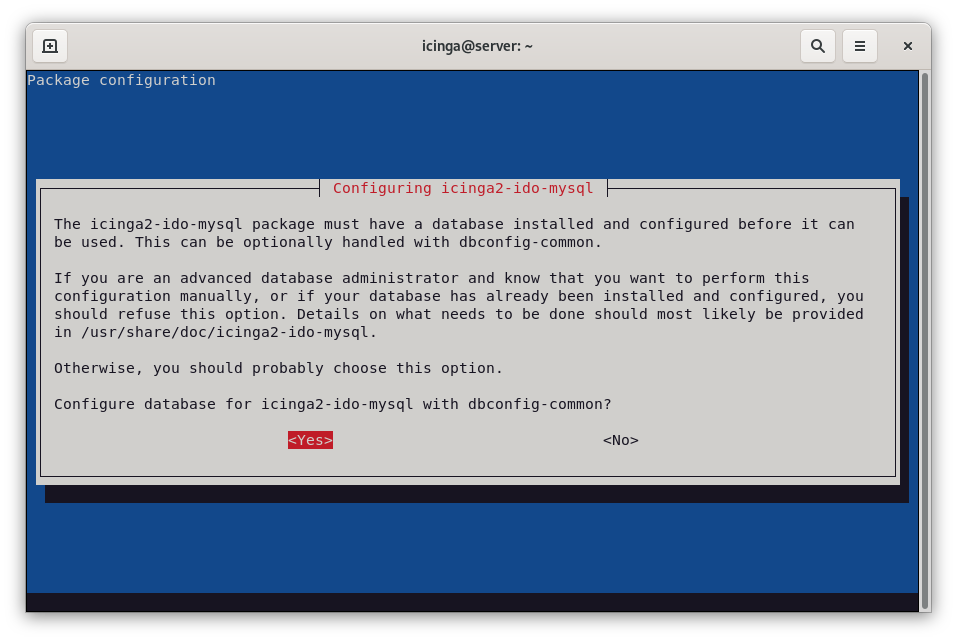
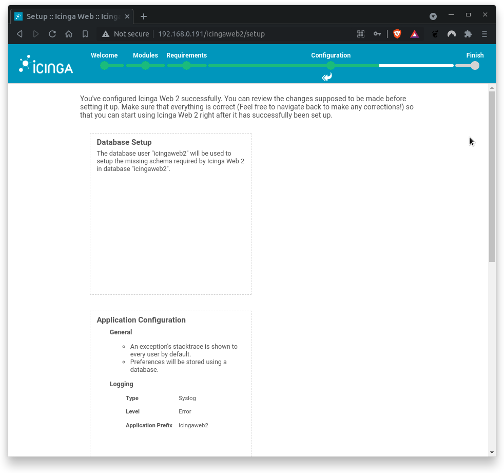
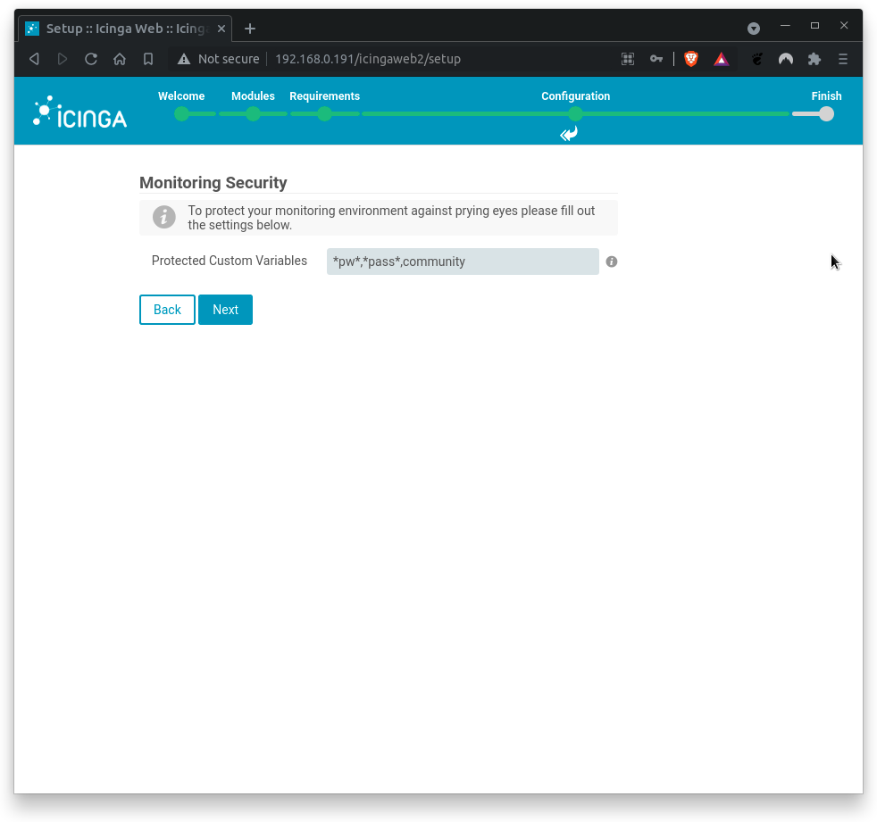

summary: BITI IPM Lab - Icinga Installation
id: biti-ipm-icinga-installation-lab
categories: icinga
tags: ipm, icinga, BITI, introduction
status: Draft
authors: Roland Pellegrini

# BITI IPM Lab - Icinga Installation

<!-- ------------------------ -->

## Before You Begin

### What You’ll Learn

In this codelab you will learn

- how to install Icinga2 on Debian
- how to configure Icinga2 as a single node

### Where You Can Look Up

The best source of documentation is the homepage of Icinga2. The latest documentation can be found [here](https://icinga.com/docs/icinga-2/latest/doc/01-about/).

### What You'll need

#### Guest operation system (Guest OS)

This is the OS of the virtual machine. This will be Debian .

#### Administators privileges

By default, administrator privileges are required on the Host OS to install additional software. Make sure that you have the required permissions.

For the Guest OS, you will create and manage your own users. These users will therefore be different from the Host's user administration.

### Root privileges via sudo

In this codelab you have to work with root privileges. Therefore, a few words of caution: double check whatever you type and make backups whenever necessary.

Working with root privileges is quite easy. Open a terminal (a shell) and enter the following commmand:

```
sudo -s
```

Enter the password of the icinga user and voila:

```
root@server:/home/icinga#
```

As soon as you are root via sudo, it is no longer necessary to precede the sudo command. Instead of `sudo ls -lisa /root/` you can also type `ls -lisa /root/` because you have root privileges already. However, all commands in this codelab will always start with `sudo` to remind you that you are working with root privileges.

<!-- ------------------------ -->

## System update

### Description

Run the following commands to update your system package repositories and your system.

```
sudo apt update
sudo apt upgrade
```

<aside class="positive">
When using the sudo command, you will be prompted for your password.
</aside>

Depending on the package upgrades, it is useful to restart the system here.

<!-- ------------------------ -->

## Icinga2 Core App

### Core App

Now that Icinga 2 repos are available, you can install Icinga core by running the command below:

```
sudo apt install icinga2
```

During installation, the apt command displays the following information.

```
--- more ---
enabling default icinga2 features
Enabling feature checker. Make sure to restart Icinga 2 for these changes to take effect.
Enabling feature notification. Make sure to restart Icinga 2 for these changes to take effect.
Enabling feature mainlog. Make sure to restart Icinga 2 for these changes to take effect.
--- more ---
```

<aside class="positive">
Please do not restart any Icinga2 service here. We will do this later. 
</aside>

On Debian, Icinga2 is started and activated during installation. You can check this by executing the command:

```
systemctl status icinga2
```

Sample output:

```
  icinga2.service - Icinga host/service/network monitoring system
     Loaded: loaded (/lib/systemd/system/icinga2.service; enabled; vendor preset: enabled)
     Active: active (running) since Wed 2021-10-16 22:05:17 CET; 35min ago
       Docs: https://icinga.com/docs/icinga2/latest/
    Process: 9826 ExecStartPre=/usr/lib/icinga2/prepare-dirs /usr/lib/icinga2/icinga2 (code=exited, status=0/SUCCESS)
   Main PID: 9831 (icinga2)
      Tasks: 18 (limit: 2324)
     Memory: 12.5M
        CPU: 3.207s
     CGroup: /system.slice/icinga2.service
             ├─9831 /usr/lib/x86_64-linux-gnu/icinga2/sbin/icinga2 --no-stack-rlimit daemon -e
             ├─9851 /usr/lib/x86_64-linux-gnu/icinga2/sbin/icinga2 --no-stack-rlimit daemon -e
             └─9856 /usr/lib/x86_64-linux-gnu/icinga2/sbin/icinga2 --no-stack-rlimit daemon -e

Oct 16 22:30:47 server icinga2[9851]: [2021-10-16 22:30:47 +0100] information/IdoMysqlConnection: Pending queries: 5 (Input: 3/s; Output: 3/s)
Oct 16 22:35:17 server icinga2[9851]: [2021-10-16 22:35:17 +0100] information/ConfigObject: Dumping program state to file '/var/lib/icinga2/icinga2.state'
Oct 16 22:35:37 server icinga2[9851]: [2021-10-16 22:35:37 +0100] information/WorkQueue: #6 (ApiListener, RelayQueue) items: 0, rate:  0/s (0/min 0/5min 0/15min);
Oct 16 22:35:37 server icinga2[9851]: [2021-10-16 22:35:37 +0100] information/WorkQueue: #7 (ApiListener, SyncQueue) items: 0, rate:  0/s (0/min 0/5min 0/15min);
Oct 16 22:35:47 server icinga2[9851]: [2021-10-16 22:35:47 +0100] information/IdoMysqlConnection: Pending queries: 0 (Input: 3/s; Output: 3/s)
Oct 16 22:39:07 server icinga2[9851]: [2021-10-16 22:39:07 +0100] information/IdoMysqlConnection: Pending queries: 11 (Input: 3/s; Output: 2/s)
Oct 16 22:40:17 server icinga2[9851]: [2021-10-16 22:40:17 +0100] information/ConfigObject: Dumping program state to file '/var/lib/icinga2/icinga2.state'
Oct 16 22:40:37 server icinga2[9851]: [2021-10-16 22:40:37 +0100] information/WorkQueue: #6 (ApiListener, RelayQueue) items: 0, rate:  0/s (0/min 0/5min 0/15min);
Oct 16 22:40:37 server icinga2[9851]: [2021-10-16 22:40:37 +0100] information/WorkQueue: #7 (ApiListener, SyncQueue) items: 0, rate:  0/s (0/min 0/5min 0/15min);
Oct 16 22:40:47 server icinga2[9851]: [2021-10-16 22:40:47 +0100] information/IdoMysqlConnection: Pending queries: 0 (Input: 3/s; Output: 4/s)
```

Check if the status Active is in **running** mode which indicates that the service is up and running.

### Monitoring Plugins

Icinga 2 also requires additional monitoring plugins to check external services. Execute the command below to install the plugins:

```
sudo apt install monitoring-plugins
```

<aside class="positive">
The command above will install a lot of Nagios-plugins. Remember the origin of Icinga.
</aside>

## Icinga2 Backend

### Database installation

<!-- 
Currently, the Debian repository contains MariaDB server 10.5, which causes problems during installation and IT operations.

To resolve this issue, follow the next steps to install MariaDB 10.6 on your current Debian servers:

```
sudo apt install software-properties-common dirmngr
```

Execute the following commands to import the MariaDB signing key and add the MariaDB APT repository.

```
sudo apt-key adv --fetch-keys 'https://mariadb.org/mariadb_release_signing_key.asc'
sudo add-apt-repository 'deb [arch=amd64,arm64,ppc64el] https://mariadb.mirror.liquidtelecom.com/repo/10.6/debian bookworm main'
```

Next, update package repositories and install both, the MariaDB server and the client. Proceed to install MariaDB packages and all its dependencies.
-->

Icinga 2 requires a database as backend. In this codelab, we will install and use MariaDB server. Let's begin:

```
sudo apt update
sudo apt install mariadb-server mariadb-client
```

After installation, check the status of the MariaDB service with the following command:

```
sudo systemctl status mariadb

```

Sample output

```
root@server:~# systemctl status mariadb
● mariadb.service - MariaDB 10.6.4 database server
     Loaded: loaded (/lib/systemd/system/mariadb.service; enabled; vendor preset: enabled)
    Drop-In: /etc/systemd/system/mariadb.service.d
             └─migrated-from-my.cnf-settings.conf
     Active: active (running) since Sat 2021-10-16 21:43:23 CEST; 34s ago
       Docs: man:mariadbd(8)
             https://mariadb.com/kb/en/library/systemd/
    Process: 25828 ExecStartPre=/usr/bin/install -m 755 -o mysql -g root -d /var/run/mysqld (code=>
    Process: 25829 ExecStartPre=/bin/sh -c systemctl unset-environment _WSREP_START_POSITION (code>
    Process: 25832 ExecStartPre=/bin/sh -c [ ! -e /usr/bin/galera_recovery ] && VAR= ||   VAR=`cd >
    Process: 25895 ExecStartPost=/bin/sh -c systemctl unset-environment _WSREP_START_POSITION (cod>
    Process: 25897 ExecStartPost=/etc/mysql/debian-start (code=exited, status=0/SUCCESS)
   Main PID: 25881 (mariadbd)
     Status: "Taking your SQL requests now..."
      Tasks: 12 (limit: 4658)
     Memory: 72.0M
        CPU: 1.103s
     CGroup: /system.slice/mariadb.service
             └─25881 /usr/sbin/mariadbd

Oct 16 22:43:29 server /etc/mysql/debian-start[25902]: Phase 6/7: Checking and upgrading tables
Oct 16 22:43:29 server /etc/mysql/debian-start[25902]: Processing databases
Oct 16 22:43:29 server /etc/mysql/debian-start[25902]: information_schema
Oct 16 22:43:29 server /etc/mysql/debian-start[25902]: performance_schema
Oct 16 22:43:29 server /etc/mysql/debian-start[25902]: sys
Oct 16 22:43:29 server /etc/mysql/debian-start[25902]: sys.sys_config                             >
Oct 16 22:43:29 server /etc/mysql/debian-start[25902]: Phase 7/7: Running 'FLUSH PRIVILEGES'
Oct 16 22:43:29 server /etc/mysql/debian-start[25902]: OK
Oct 16 22:43:29 server /etc/mysql/debian-start[26501]: Checking for insecure root accounts.
```

Please check the follwing lines:

```
Loaded: loaded (/lib/systemd/system/mariadb.service; enabled; vendor preset: enabled)
...
Active: active (running) since Sat 2021-10-16 21:43:23 CEST; 34s ago
```

If MariaDB is not up and running, start MariaDB manually and enable the service with the following commands:

```
sudo systemctl start mariadb
sudo systemctl enable mariadb
```

Afterwards, check the status of the MariaDB service again:

```
sudo systemctl status mariadb

```

Contratulations, you have successfully installed MariaDB 10.5 on Debian. Great job!


### IDO modules for MariaDB/MySQL

The package `icinga2-ido-mysql` provides Icinga Data Output (IDO) modules for MySQL and can be installed by running the command below:

```
sudo apt install icinga2-ido-mysql
```

During installation, you will be prompted to specify whether Icinga 2 should use MySQL. Select `Yes` to enable this feature.


Next, you will be asked to specify whether database should be configured with dbconfig-common. Select `Yes` to enable dbconfig-common.


<aside class="positive">
Dbconfig-common is controversially discussed by the community. This framework presents a guideline for managing various databases used by applications in Debian packages. However, the community doesn´t like to be patronized.
<br>
<br>
As a result, most database administrators simply don't like the dbconfig-common framework. 
<br>
<br>
However, we choose this option because we don't want to administrate a database. Instead, we just want to use it for demonstration purpose only.
</aside>

Next, you will be asked to provide MySQL application password for icinga2-ido-mysql as shown in the following screen. To keep things easy, use `icinga2` as password.

<aside class="negative">
Warning: 
<br>
Under no circumstances do not use this password in other systems or environments, especially not in a production system. We use this password to ensure a smooth installation process during the lecture and to eliminate potential sources of error.
</aside>


You have to repeat the password. Type `icinga2` again and hit **ENTER**.


Finally, you can check wether `ido-mysql` feature is enabled. Run the command:

```
sudo icinga2 feature list
```

The command above lists both disabled and enabled features:

```
Disabled features: api command compatlog debuglog elasticsearch gelf graphite icingadb ido-mysql influxdb livestatus opentsdb perfdata statusdata syslog

Enabled features: checker mainlog notification
```

Typically, only the `checker mainlog notification` functions are activated, while the `ido-mysql` function is deactivated.

Enable the feature `ido-mysql` with the following command:

```
sudo icinga2 feature enable ido-mysql
```

Check the status of the `ido-mysql` feature by runnning the following command again:

```
sudo icinga2 feature list
```

The feature `ido-mysql` is now activated:

```
Disabled features: api command compatlog debuglog elasticsearch gelf graphite icingadb influxdb livestatus opentsdb perfdata statusdata syslog

Enabled features: checker ido-mysql mainlog notification
```

Great, everything done correctly. Now restart Icinga 2 and check its status.

```
sudo systemctl restart icinga2
sudo systemctl status icinga2
```

<!-- ------------------------ -->

## IDO Configfile

Next, open Icinga 2 MySQL IDO configuration file and set the Icinga2 database connection details.

```
sudo nano /etc/icinga2/features-available/ido-mysql.conf
```

The configuration **must** look like this:

```
/**
 * The db_ido_mysql library implements IDO functionality
 * for MySQL.
 */

library "db_ido_mysql"

object IdoMysqlConnection "ido-mysql" {
  user = "icinga2",
  password = "icinga2",
  host = "localhost",
  database = "icinga2"
}
```
Double-check the content of this file. Enter the connection details of the Icinga2 database manually if required.

Exit the editor with `CTRL-X`. If necessary, confirm with "y" if you have changed something in the configuration file.

## Icinga2 Restart

### One-liner

If you have modified the file `/etc/icinga2/features-available/ido-mysql.conf` in the previous section, restart the Icinga2 service and check its status again:

```
sudo systemctl restart icinga2
sudo systemctl status icinga2
```

<aside class="positive">
It is quite common that you have to restart icinga2 several times. The reason for this is that Icinga2 ignores updated configs if the service is not restarted.
</aside>

## Icinga Web2 Frontend

### Installation

Icinga Web 2 requires Icinga 2 with IDO configured as well as some additional requirements such as a web server, PHP and some extensions. You must therefore install these requirements first before configuring the front end. Let's start with the core frontend:

```
sudo apt install icingaweb2
```

### Authentication Token

Icinga web setup requires authentication with a token. Generate the auth token:

```
sudo icingacli setup token create
```

<aside class="positive">
An authentication token (auth token) is a computer-generated code that verifies a user’s identity. Auth tokens are used to access websites, applications, services, and application programming interfaces (APIs). They allow users (or services) to access these resources without having to re-enter their login credentials each time they visit.
</aside>


Sample output:

```
The newly generated setup token is: **7fb3fb0cbae252b3**
```

No need to remember the token. Use the following command to display the token on screen:

```
sudo icingacli setup token show
```

<aside class="positive">
Just a reminder: You will need the token for the frontend wizard.
</aside>

Next, make sure that the Icinga Web 2 system group exists. Also make sure that the web server user `www-data` is a member of this group.

```
sudo id www-data
```

Sample output:

```
uid=33(www-data) gid=33(www-data) groups=33(www-data),117(icingaweb2)
```

### Restart Apache Web Server

Restart the web server to apply all changes:

```
sudo systemctl restart apache2
sudo systemctl status apache2
```

## Icinga Web2 Backend

### Database installation

Sorry but true: you have to create another database and a db user for Icinga web 2. But this time, you will do this manually.

First, log in to MariaDB shell with the following command:

```
sudo mysql -u root -p
```

Provide your root password (or simple press enter) and create a database and a user for Icinga web 2 with the following command:

Run the following command to get a list of databases installed.
```
show databases;
```

Sample output:
```
Welcome to the MariaDB monitor.  Commands end with ; or \g.
Your MariaDB connection id is 43
Server version: 10.11.4-MariaDB-1~deb12u1 Debian 12

Copyright (c) 2000, 2018, Oracle, MariaDB Corporation Ab and others.

Type 'help;' or '\h' for help. Type '\c' to clear the current input statement.

MariaDB [(none)]> show databases;
+--------------------+
| Database           |
+--------------------+
| icinga2            |
| information_schema |
| mysql              |
| performance_schema |
| sys                |
+--------------------+
5 rows in set (0.001 sec)

MariaDB [(none)]>
```

 Notice the database named `icinga2`. This is the database of the Icinga2 core system. Now, we need an additional database for the Icinga Web2 Frontend.

 <aside class="positive">
Icinga2 needs two different databases, one for the Core system and another one for the Web Frontend.
</aside>
 
 Now, run the following command to create the new database for Icinga Web2: 

```
create database icingaweb2;
```

MariaDB/MySQL answers with:

```
Query OK, 1 row affected (0.001 sec)
```

Next, create the Icinga 2 database user. Remember, we want to keep things easy.

```
grant all on icingaweb2.* to icingaweb2@localhost identified by 'icingaweb2';
```

<aside class="positive">
Check the documentation of MariaDB/MySQL for the optional IDENTIFIED BY clause.
</aside>

MariaDB/MySQL answers with:

```
Query OK, o row affected (0.001 sec)
```

<aside class="negative">
Warning: 
<br>
Under no circumstances do not use this password in other systems or environments, especially not in a production system. We use this password to ensure a smooth installation process during the lecture and to eliminate potential sources of error.
</aside>

Just be be sure: Execute the following command and check whether the new database exists:
```
show databases;
```

Sample output:
```
+--------------------+
| Database           |
+--------------------+
| icinga2            |
| icingaweb2         |
| information_schema |
| mysql              |
| performance_schema |
| sys                |
+--------------------+
```

Next, check if the newly created user exists:
```
select user from mysql.user;
```

Sample output:

```
+-------------+
| User        |
+-------------+
| icinga2     |
| icingaweb2  |
| mariadb.sys |
| mysql       |
| root        |
+-------------+
```

Everything okay? Good. Now reload privileges tables with the following commands:

```
flush privileges;
quit
```

<aside class="negative">
Check the documentation of MariaDB/MySQL for the FLUSH statement.
</aside>

That's it. Mission accomplished!

## Icinga Web2 Frontend

### Setup Wizard

<aside class="positive">
The Icinga Web 2 page can be opened either inside the GuestOS or outside the HostOS with network bridge enabled. It's recommended to open the Icinga Web 2 page from the HostOS.
</aside>

To access the setup wizard, use the following address:

```
http://<icinga-server-ip>/icingaweb2/
```

The Welcome wizard shows up.


Enter your authentication token and click `Next` to proceed. If you do not know the authentication token, run the following command again:

```
sudo icingacli setup token show
```

On the next page, you can select the Icinga modules you want to activate.


Ensure that Monitoring module is activated only. If true, click on `Next`.

The following page verifies wether the required PHP extensions meet the requirements. In case of missing PHP extensions, install them and proceed with setup.


As you can see, only the PHP extensions for PostgreSQL are missing. This is fine, as we use MySQL/MariaDB. All otherPHP modules are available. Great! 

Click on `Next` to proceed.

Next, you need to configure the Icinga Web 2 authentication method. Since this Codelab uses local authentication only, select `Database`.


Click on `Next` to proceed.

Next, configure database authentication details as described below.


Where

- `Database Name` = icingaweb2
- `Usermame` = icingaweb2
- `Password` = icingaweb2

<aside class="positive">
Don't touch Resource Name, Database Type or Host.
</aside>

Click on `Validate Configuration` to test the db connectivity. You should get a positive feedback (configuration bas been successfully validated). If errors occur, check on typos.


Click on `Next` when done.

Next, set up the Icinga web 2 authentication backend name.


Where

- `Backend Name` = icingaweb2

Click on `Next` when backend name is correct.

Next, set up the Icinga Web 2 administrative user.


Where

- `Username` = icinga2
- `Password` = icinga2
- `Repeat Password` = icinga2

<aside class="negative">
Warning: 
<br>
Under no circumstances do not use this password in other systems or environments, especially not in a production system. We use this password to ensure a smooth installation process during the lecture and to eliminate potential sources of error.
</aside>

Click on `Next` when done.

Next, configure application and logging related options.


Where

- `Show Stacktraces` = yes
- `Show Application State Messages` = yes
- `User Preference Storage Type` = Database
- `Logging Type` = Syslog
- `Logging Level` = Error
- `Application Prefix` = icingaweb2
- `Facility` = user

Click on `Next` when done.

Next, the Icinga Web 2 configuration summary shows up.



Double-check the summary. Click on `Next` when done.

On the next screen, another configuration section for Icinga Web 2 monitoring module welcomes you.


Click on `Next` when done.

<!-- Next, configure how Icinga Web 2 shoudl retrieve monitoring information.


Where,

- Backend Name = icinga2
- Backend Type = IDO

<aside class="positive">
If you get the following error message “There is currently no icinga instance writing to the IDO. Make sure that a icinga instance is configured and able to write to the IDO“, ido-mysql is not enabled. In this case, go back to Icinga2 Backend section, enable the module and restart Icinga 2.
</aside>
-->

Next, fill out the connection details to access the IDO database of the monitoring environment.


Where,

- `Database Name` = icinga2
- `Username` = icinga2
- `Password` = icinga2

You should (hopefully) get a positive feedback.


If errors occur, check on typos.

Click on `Next` when done.

Next, define how you want to send commands to you monitoring environment. In this codelab, we are setting up `Local Command File` transport type.


Where,

- `Transport name` = icinga2
- `Transport type` = Local Command File
- `Command File` = /var/run/icinga2/cmd/icinga2.cmd

Click on `Next` when done.

Next, fill out the settings to protect your monitoring environment against prying eyes.



Where,

- `Protected Custom Variables` = \*pw\*,\*pass\*,community

Click on `Next` when done.

Finally, review the configuration summary and click `Finish` to complete the installation.


Congratulations, you have installed and set up Icinga2 successfully. Click on `Login to Icinga Web 2`


## Icinga Web2 Login

Enter the username and password from the previous section.


If URL is unknown, try this:

```
http://<icinga-server-ip>/icingaweb2/
```

<aside class="negative">
Forgot user and password? Go back to the Icinga Web2 Frontend section .
</aside>

After logging in, Icinga2 will greet you with one or more critical messages:


Congratulations! You have successfully installed Icinga2 and Icingaweb2 on your GuestOS. You can now browse through the sidebar menu to discover the features of Icinga2. Familiarize yourself with the menu navigation.
