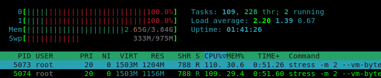

summary: BITI IPM Lab - Memory
id: biti-ipm-memory-lab
categories: linux
tags: ipm, memory, ram, BITI, introduction
status: Published
authors: Roland Pellegrini

# BITI IPM Lab - Memory
<!-- ------------------------ -->
## Before You Begin 

### What You’ll Learn
Memory is usually referred to as the main memory of a computer, e.g. the random access memory (RAM). Memory is also the place where information is processed. Along with the CPU, RAM is one of the most important components that determine the performance of your system. RAM is where applications can store and retrieve data for short periods of time. 

In this codelab you will learn how to identify the memory, how fast it works and how it is used. For this we will use only tools that come with the operating system. 


###  Where You Can Look Up
The **man** is a short term for manual page and acts as an interface to view the reference manual of a command.

Syntax of man:
```
man [option(s)] keyword(s)
```

For example, if you want top find out more about the command **ps** and how to use it, just open a shell and type:
```
man ps
```

This command will display all the information about **ps**.
```
PS(1)                            User Commands                           PS(1)

NAME
       ps - report a snapshot of the current processes.

SYNOPSIS
       ps [options]

DESCRIPTION
       ps displays information about a selection of the active processes.  If
       you want a repetitive update of the selection and the displayed
       information, use top(1) instead.
...
...
```
### What You'll need

#### Guest operation system (Guest OS)

This is the OS of the virtual machine. This will be Debian 11 (Bullseye) or Microsoft Windows.

#### Administators privileges

By default, administrator privileges are required on the Host OS to install additional software. Make sure that you have the required permissions.

For the Guest OS, you will create and manage your own users. These users will therefore be different from the Host's user administration. 

## Display Memory information on Linux

### What You will learn:

You can use one of the following commands to find detailed information about the physical CPUs (pCPU) including all cores on Linux:

* meminfo 
* dmidecode 

### #1. meminfo 

All Linux distributions allows you to run **cat /proc/meminfo**. This file contains details about the memory installed. Note that /proc is a pseudo-filesystem, it is used as an interface to kernel data structures.

Open a shell and run the following command:
```
cat /proc/meminfo | more
```

Check the values of MemTotal, MemFree, Buffers, Cached, SwapTotal, SwapFree. They indicate same values of memory usage as the **free** command (see next paragraph).
```
icinga@server:/# cat /proc/meminfo | more
MemTotal:        4025712 kB
MemFree:         2697848 kB
MemAvailable:    3154120 kB
Buffers:           32964 kB
Cached:           622588 kB
SwapCached:            0 kB
Active:           246096 kB
Inactive:         927612 kB
Active(anon):       1188 kB
Inactive(anon):   531128 kB
Active(file):     244908 kB
Inactive(file):   396484 kB
Unevictable:        7636 kB
Mlocked:            7636 kB
SwapTotal:        998396 kB
SwapFree:         998396 kB
Dirty:              2548 kB
Writeback:             0 kB
AnonPages:        499488 kB
Mapped:           264728 kB
Shmem:             10156 kB
KReclaimable:      35852 kB
Slab:              80840 kB
--More--
```

<aside class="positive">
Consult the documentation and man-pages for more details. Try to identify keywords and details of the memory. 
</aside>


### #2. The demidecode command

To find out hardware information about the installed RAM, use the **demidecode** command. we used this little tool in the CPU lab. **demidecode** reports lots of information about the installed RAM memory.

Open a shell and run **cmstat** with root privileges
```
dmidecode -t memory | more
```

Information is grouped per memory device. That means that every memory device is listed separately and various details about the memory are included in the description. 

Sample output
```
Getting SMBIOS data from sysfs.
SMBIOS 2.8 present.

Handle 0x0026, DMI type 16, 23 bytes
Physical Memory Array
	Location: System Board Or Motherboard
	Use: System Memory
	Error Correction Type: None
	Maximum Capacity: 16 GB
	Error Information Handle: Not Provided
	Number Of Devices: 2

Handle 0x0027, DMI type 17, 40 bytes
Memory Device
	Array Handle: 0x0026
	Error Information Handle: Not Provided
	Total Width: 64 bits
	Data Width: 64 bits
	Size: 8192 MB
	Form Factor: SODIMM
	Set: None
	Locator: DIMM3
	Bank Locator: BANK 0
	Type: DDR3
	Type Detail: Synchronous
	Speed: 1600 MT/s
	Manufacturer: Samsung
	Serial Number: 2266B43B
	Asset Tag: 9876543210
	Part Number: M471B1G73BH0-YK0  
	Rank: 2
	Configured Memory Speed: 1600 MT/s
	Minimum Voltage: 1.35 V
	Maximum Voltage: 1.5 V
	Configured Voltage: 1.5 V

Handle 0x0028, DMI type 17, 40 bytes
Memory Device
	Array Handle: 0x0026
	Error Information Handle:
--More--
```

## Memory monitoring tools on Linux

### What You will learn:

You can use one of the following command to monitor the memory on Linux:

* free 
* vmstat

### #1. The free command

The **free** command is a simple and easy to use command to check memory usage on Linux.  It provides information about the total amount of the physical and swap memory, as well as the free and used memory. 

Here is a quick example:
```
free -h
```
The `-h` option presents the data in human-friendly form, scaling to the shortest three-digit unit. The sample output will include three lines, a header, one line for the memory and one for the swap:

```
               total        used        free      shared  buff/cache   available
Mem:           3.8Gi       617Mi       2.6Gi        13Mi       680Mi       3.0Gi
Swap:          974Mi          0B       974Mi
```

Where
* total - This number represents the total amount of memory that can be used by the applications.
* used - Used memory. It is calculated as: used = total - free - buffers - cache
* free - Free / Unused memory.
* shared - This column can be ignored as it has no meaning. It is here only for backward compatibility.
* buff/cache - The combined memory used by the kernel buffers and page cache. This memory can be reclaimed at any time if needed by the applications. If you want buffers and cache to be displayed in two separate columns, use the -w option.
* available - An estimate of the amount of memory that is available for starting new applications, without swapping.

The free command also allows you to specify the unit in which the memory is measured. Some of the options are:

* -b, --bytes - Display output in bytes.
* --kilo - Display output in kilobytes (1KB = 1000bytes).
* --mega - Display output in megabytes.
* --giga - Display output in gigabytes.
* --tera - Display output in terabytes.

<aside class="positive">
Consult the documentation and man-pages for more details. Try to identify keywords and details of the memory. 
</aside>

To continuously display the memory information on the screen, invoke **free** with the `-s (--seconds)` option followed by a number that specifies the delay. This is similar to the behavior of the **watch** command.
```
free -s 5
watch free
```

### #2. The vmstat command

The **vmstat** (virtual memory statistics) command is a valuable monitoring utility that collects and displays information about system memory, processes, paging and block I/O and more. Using **vmstat**, you can specify a sampling interval to observe system activity in near-real time.

Open a shell and run **cmstat** without any option:
```
vmstat
```

Sample output:
```
procs -----------memory---------- ---swap-- -----io---- -system-- ------cpu-----
 r  b   swpd   free   buff  cache   si   so    bi    bo   in   cs us sy id wa st
 1  0      0 2688900  34784 665548    0    0   132    23  165   71  1  0 99  0  0
```

As shown, the **vmstat** command provides information about Processes, Memory, I/O, system and CPU. In this lab we will only focus on Memory, Swap and CPU (optional):
* Memory
    * swpd: the amount of virtual memory used.
    * free: the amount of idle memory.
    * buff: the amount of memory used as buffers.
    * cache: the amount of memory used as cache.
* Swap
    * si: Amount of memory swapped in from disk (/s).
    * so: Amount of memory swapped to disk (/s).
* CPU
    * These are percentages of total CPU time.
    * us: Time spent running non-kernel code. (user time, including nice time)
    * sy: Time spent running kernel code. (system time)
    * id: Time spent idle. Prior to Linux 2.5.41, this includes IO-wait time.
    * wa: Time spent waiting for IO. Prior to Linux 2.5.41, included in idle.
    * st: Time stolen from a virtual machine. Prior to Linux 2.6.11, unknown.

<aside class="positive">
Consult the documentation and man pages for more details. Try to identify keywords and details not only of the memory, but also the details about processes, I/O and more. 
</aside>

## Hands-on: Memory Monitoring on Linux

### What you will learn:

In this codelab, you will learn 

* how to use the free programm
* how to generate workload

### What you will need:

In this codelab, you will need the following tools:

* free 
* Stress
* htop

Details of the **Stress** tool can be found in the corresponding Codelab named `Stress the computer`,  details of the **htop** can be found in the Codelab `Compute`

### Scenario

In this codelab, the target is a Virtual Machine with 2 CPUs and 4 GB RAM. The operating system is based on Debian 11.0 (Bullseye) with Linux kernel version 5.10.0-8-amd64.

* Open a shell terminal and execute the following command:
```
watch free
```

* Open a second terminal and execute the following command:
```
htop
```

* Open the last shell terminal and start the workload generator with the following option.
```
stress -m 2 --vm-bytes 1500M -t 30s -v
```
Notice that the workload generator runs with a time limit of 30 seconds.

* Observe how the memory utilization changes.

* Sample output for **free**:
 

* Sample output for **htop** 


The stress tool should stop working after the specified time 30. If not, you can stop the program with `CTRL-C`. You can also stop all running stress processes with the following command:
```
killall stress
```

Finally, you can stop the remaining programs and close all open terminals. 

This is the end of the hands-on.