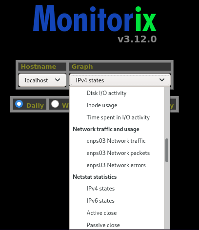
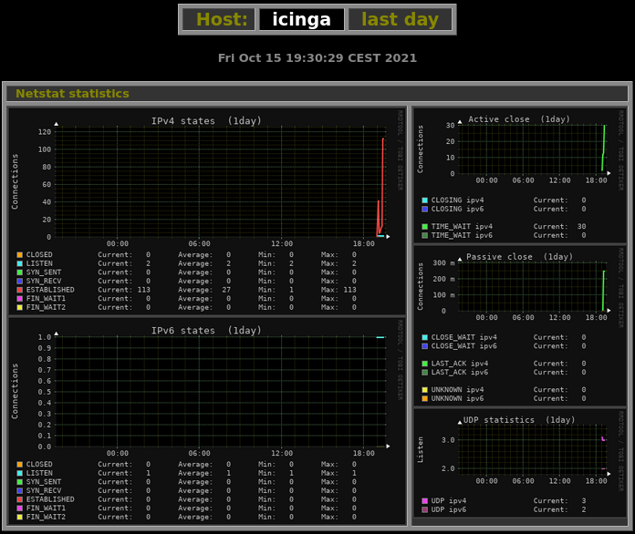
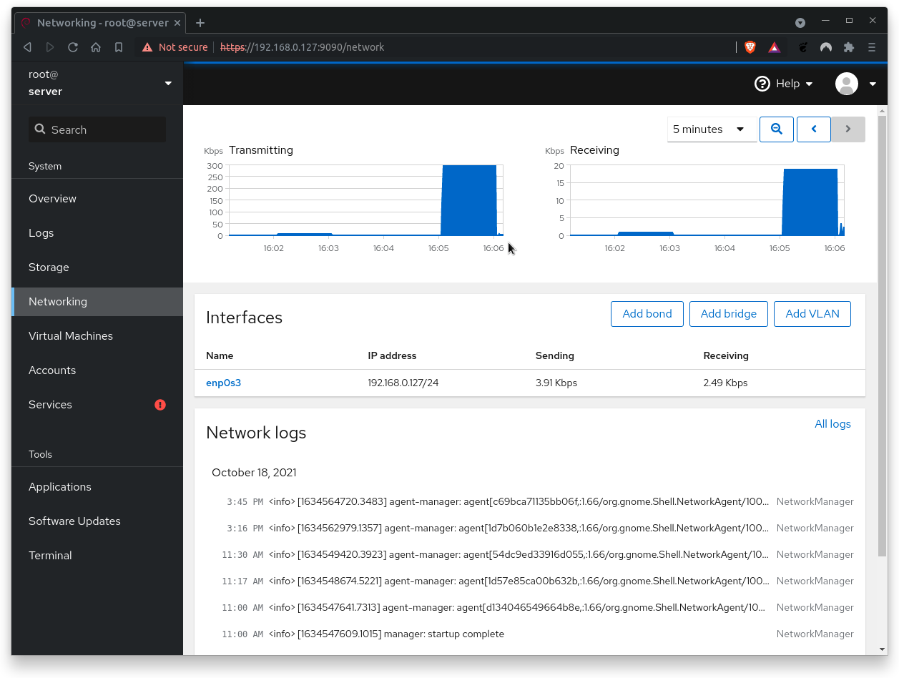

summary: BITI IPM Lab - Network
id: biti-ipm-network-linux-lab
categories: linux
tags: ipm, memory, ram, BITI, introduction
status: Published
authors: Roland Pellegrini

# BITI IPM Lab - Network

<!-- ------------------------ -->

## Before You Begin

### What You’ll Learn

In this codelab you will learn

- how to get information about local network devices
- how to monitor networks using Linux tools
- how to check network performance

### Where You Can Look Up

The **man** is a short term for manual page and acts as an interface to view the reference manual of a command.

Syntax of man:

```
man [option(s)] keyword(s)
```

For example, if you want top find out more about the command **ps** and how to use it, just open a shell and type:

```
man ps
```

This command will display all the information about **ps**.

```
PS(1)                            User Commands                           PS(1)

NAME
       ps - report a snapshot of the current processes.

SYNOPSIS
       ps [options]

DESCRIPTION
       ps displays information about a selection of the active processes.  If
       you want a repetitive update of the selection and the displayed
       information, use top(1) instead.
...
...
```

### What You'll need

#### Guest operation system (Guest OS)

This is the OS of the virtual machine. This will be Debian .

#### Administators privileges

By default, administrator privileges are required on the Host OS to install additional software. Make sure that you have the required permissions.

For the Guest OS, you will create and manage your own users. These users will therefore be different from the Host's user administration.

## Device information

### What You will learn:

You can use one of the following commands to find detailed information about the physical or virtual network devices on Linux:

- lspci
- hwinfo
- ip
- nmcli

## lscpi

### Description

The **lspci** command is a utility on linux systems used to find out information about the Peripheral Component Interconnect (PCI) busses and devices connected to the PCI subsystem.

### Sample code

To list all PCI devices, run the following command:

```
lspci
```

### Sample output

```
00:00.0 Host bridge: Intel Corporation 440FX - 82441FX PMC [Natoma] (rev 02)
00:01.0 ISA bridge: Intel Corporation 82371SB PIIX3 ISA [Natoma/Triton II]
00:01.1 IDE interface: Intel Corporation 82371AB/EB/MB PIIX4 IDE (rev 01)
00:02.0 VGA compatible controller: VMware SVGA II Adapter
00:03.0 Ethernet controller: Intel Corporation 82540EM Gigabit Ethernet Controller (rev 02)
00:04.0 System peripheral: InnoTek Systemberatung GmbH VirtualBox Guest Service
00:05.0 Multimedia audio controller: Intel Corporation 82801AA AC'97 Audio Controller (rev 01)
00:06.0 USB controller: Apple Inc. KeyLargo/Intrepid USB
00:07.0 Bridge: Intel Corporation 82371AB/EB/MB PIIX4 ACPI (rev 08)
00:0b.0 USB controller: Intel Corporation 82801FB/FBM/FR/FW/FRW (ICH6 Family) USB2 EHCI Controller
00:0d.0 SATA controller: Intel Corporation 82801HM/HEM (ICH8M/ICH8M-E) SATA Controller [AHCI mode] (rev 02)
```

The list shows the model of the Ethernet controller, but not the network device interfaces. For this we need another tool.

### References

Need help? Use this:

```
man lspci
```

## hwinfo

### Description

The tool **hwinfo** checks details of the hardware present in a Linux system and displays the extensive details of each hardware device. It reports information about most hardware units including network controller and network cards.

<aside class="positive">
Hwinfo requires root privileges.
</aside>

### Sample code

Run the following command:

```
hwinfo
```

### Sample output

The section "Ethernet controller" may look like this:

```
16: PCI 03.0: 0200 Ethernet controller
  [Created at pci.386]
  Unique ID: Fybr.GkSpXDNdaaB
  SysFS ID: /devices/pci0000:00/0000:00:03.0
  SysFS BusID: 0000:00:03.0
  Hardware Class: network
  Model: "Intel PRO/1000 MT Desktop Adapter"
  Vendor: pci 0x8086 "Intel Corporation"
  Device: pci 0x100e "82540EM Gigabit Ethernet Controller"
  SubVendor: pci 0x8086 "Intel Corporation"
  SubDevice: pci 0x001e "PRO/1000 MT Desktop Adapter"
  Revision: 0x02
  Driver: "e1000"
  Driver Modules: "e1000"
  Device File: enp0s3
  Memory Range: 0xf0200000-0xf021ffff (rw,non-prefetchable)
  I/O Ports: 0xd020-0xd027 (rw)
  IRQ: 19 (430908 events)
  HW Address: 08:00:27:38:d0:34
  Permanent HW Address: 08:00:27:38:d0:34
  Link detected: yes
  Module Alias: "pci:v00008086d0000100Esv00008086sd0000001Ebc02sc00i00"
  Driver Info #0:
    Driver Status: e1000 is active
    Driver Activation Cmd: "modprobe e1000"
  Config Status: cfg=new, avail=yes, need=no, active=unknown
  --More--
```

In addition, the tool also reports the Ethernet Network Interface (which is attached to #16 Ethernet Controller) and the Loopback interface:

```
35: None 00.0: 10701 Ethernet
  [Created at net.126]
  Unique ID: wbsj.ndpeucax6V1
  Parent ID: Fybr.GkSpXDNdaaB
  SysFS ID: /class/net/enp0s3
  SysFS Device Link: /devices/pci0000:00/0000:00:03.0
  Hardware Class: network interface
  Model: "Ethernet network interface"
  Driver: "e1000"
  Driver Modules: "e1000"
  Device File: enp0s3
  HW Address: 08:00:27:38:d0:34
  Permanent HW Address: 08:00:27:38:d0:34
  Link detected: yes
  Config Status: cfg=new, avail=yes, need=no, active=unknown
  Attached to: #16 (Ethernet controller)

36: None 00.0: 10700 Loopback
  [Created at net.126]
  Unique ID: ZsBS.GQNx7L4uPNA
  SysFS ID: /class/net/lo
  Hardware Class: network interface
  Model: "Loopback network interface"
  Device File: lo
  Link detected: yes
  Config Status: cfg=new, avail=yes, need=no, active=unknown
```

### References

More information needed? See here:

```
man hwinfo
```

## ip

### Description

The `ip` command is one of the basic commands every administrator will need in daily work, from setting up new systems and assigning IPs to troubleshooting existing systems. The `ip` command can show address information, manipulate routing, plus display network various devices, interfaces, and tunnels.

### Sample code

To show the IP addresses assigned to an interface on your server:

```
ip address show
```

### Sample output

The output will look different from yours:

```
1: lo: <LOOPBACK,UP,LOWER_UP> mtu 65536 qdisc noqueue state UNKNOWN group default qlen 1000
    link/loopback 00:00:00:00:00:00 brd 00:00:00:00:00:00
    inet 127.0.0.1/8 scope host lo
       valid_lft forever preferred_lft forever
    inet6 ::1/128 scope host
       valid_lft forever preferred_lft forever
2: enp0s3: <BROADCAST,MULTICAST,UP,LOWER_UP> mtu 1500 qdisc pfifo_fast state UP group default qlen 1000
    link/ether 08:00:27:38:d0:34 brd ff:ff:ff:ff:ff:ff
    inet 192.168.7.187/24 brd 192.168.0.255 scope global dynamic noprefixroute enp0s3
       valid_lft 82004sec preferred_lft 82004sec
    inet6 fe80::a00:27ff:fe38:d034/64 scope link noprefixroute
       valid_lft forever preferred_lft forever
```

<aside class="positive">
At this point, check how the outputs of lspci, hwinfo and ip are linked together! 
</aside>

### References

Read the manual for more information:

```
man ip
```

## nmcli

### Description

**nmcli** is a command-line tool for controlling NetworkManager and reporting network status. The tool is used to create, display, edit, delete, activate, and deactivate network connections, as well as control and display network device status.

### Sample code

Open a shell and run the command twice but with different options each time:

```
nmcli device show
nmcli connection show
```

### Sample output

Here is an example of both outputs:

```
GENERAL.DEVICE:                         enp0s3
GENERAL.TYPE:                           ethernet
GENERAL.HWADDR:                         08:00:27:38:D0:34
GENERAL.MTU:                            1500
GENERAL.STATE:                          100 (connected)
GENERAL.CONNECTION:                     Wired connection 1
GENERAL.CON-PATH:                       /org/freedesktop/NetworkManager/ActiveConnection/1
WIRED-PROPERTIES.CARRIER:               on
IP4.ADDRESS[1]:                         192.168.7.187/24
IP4.GATEWAY:                            192.168.7.1
IP4.ROUTE[1]:                           dst = 0.0.0.0/0, nh = 192.168.0.1, mt = 100
IP4.ROUTE[2]:                           dst = 192.168.7.0/24, nh = 0.0.0.0, mt = 100
IP4.ROUTE[3]:                           dst = 169.254.7.0/16, nh = 0.0.0.0, mt = 1000
IP4.DNS[1]:                             192.168.7.1
IP6.ADDRESS[1]:                         fe80::a00:27ff:fe38:d034/64
IP6.GATEWAY:                            --
IP6.ROUTE[1]:                           dst = fe80::/64, nh = ::, mt = 100
IP6.ROUTE[2]:                           dst = ff00::/8, nh = ::, mt = 256, table=255

GENERAL.DEVICE:                         lo
GENERAL.TYPE:                           loopback
GENERAL.HWADDR:                         00:00:00:00:00:00
GENERAL.MTU:                            65536
GENERAL.STATE:                          10 (unmanaged)
GENERAL.CONNECTION:                     --
GENERAL.CON-PATH:                       --
IP4.ADDRESS[1]:                         127.0.0.1/8
IP4.GATEWAY:                            --
IP6.ADDRESS[1]:                         ::1/128
IP6.GATEWAY:                            --
IP6.ROUTE[1]:                           dst = ::1/128, nh = ::, mt = 256

--More--

NAME                UUID                                  TYPE      DEVICE
Wired connection 1  3bf2b392-a620-4bab-9bd6-30da11211131  ethernet  enp0s3
```

### References

Read the manual:

```
man nmcli
```

## Network measurement

### What You will learn:

You can use one of the following commands to find detailed information about the physical or virtual network devices on Linux:

- ping
- speedtest
- iperf3 (has been moved to the section `Hands-On`)

## ping

### Description

The **ping** command is one of the most used tools for diagnosing network connectivity issues.

**Ping** works by sending ICMP (Internet Control Message Protocol) Echo Request packages to a specified destination IP on the network and waits for a reply. When the destination receives the package, it responds with an ICMP echo reply.

With the **ping** command, IT Administrators can determine whether a remote destination IP is active or inactive. IT Administrators can also find the round-trip delay in communicating with the destination and check whether there is a packet loss.

<aside class="positive">
Ping is not sufficient for determining service availability. Instead, check your UDP/TCP port directly, to see if the service is still available.
</aside>

### Sample code

```
ping -c 3 www.orf.at
```

Where,

- -c 3 - Stop after sending count ECHO_REQUEST packets
- www.orf.at - the target

### Sample output

```
PING www.orf.at (194.232.104.140) 56(84) bytes of data.
64 bytes from www.orf.at (194.232.104.140): icmp_seq=1 ttl=55 time=57.9 ms
64 bytes from www.orf.at (194.232.104.140): icmp_seq=2 ttl=55 time=23.8 ms
64 bytes from www.orf.at (194.232.104.140): icmp_seq=3 ttl=55 time=21.2 ms

--- www.orf.at ping statistics ---
3 packets transmitted, 3 received, 0% packet loss, time 2002ms
rtt min/avg/max/mdev = 21.228/34.314/57.876/16.694 ms
```

Where,

- The number of data bytes. The default is 56, which translates into 64 ICMP data bytes - 64 bytes.
- The IP address of the destination - from www.orf.at (194.232.104.140).
- The ICMP sequence number for each packet. icmp_seq=1.
- The Time to Live. - ttl=53 - How does TTL work?.
- The ping time, measured in milliseconds which is the round trip time for the packet to reach the host, and the response to return to the sender. - time=21.2 ms.

### References

Ping the man:

```
man ping
```

## speedtest-cli

### Description

One of the most famous online internet connection test apps is speedtest.net. The tool **speedtest-cli** is a command line interface for testing internet bandwidth using speedtest.net. The test is simple to use and provides multiple options. To view all of them, pass the `-h` flag to display the speedtest-cli help file.

### Sample code

To run the tool, simple execute the command without options.

```
speedtest-cli
```

### Sample output

```
Retrieving speedtest.net configuration...
Testing from Hutchison Drei Austria GmbH (71.121.212.141)...
Retrieving speedtest.net server list...
Selecting best server based on ping...
Hosted by ITandTEL (Wels) [134.31 km]: 45.432 ms
Testing download speed....................
Download: 10.79 Mbit/s
Testing upload speed........................................
Upload: 1.01 Mbit/s
```

### References

What is faster than man?

```
man speedtest-cli
```

## Network monitoring

### What You will learn:

You can use one of the following tools to find detailed information about the network traffic:

- iftop
- etherape
- monitorix

## iftop

### Description

**iftop** is a real time console-based Linux network bandwidth monitoring tool. It shows a quick overview of the networking activities on an interface. It even acts as a diagnostics to diagnose which program is causing the problem to the network.

### Sample code

Run the command as follows:

```
iftop
```

To view the network bandwidth of a particular interface, use the following command.

```
iftop -i enp0s3
```

<aside class="positive">
Keep in mind the difference between eth0 and enp0s3. 
</aside>

### Sample output


Where,

- At the very top of the screen is a scale that goes along with the bar graph iftop might display with each connection.
- The next rows of output correspond to each network connection between a pair of hosts. In between the two hosts are arrows that let you know the direction the traffic is flowing.
- The final three columns provide average bandwidth for each connection during the last 2, 10 and 40 seconds, respectively.

### References

Here is the link to the documentation:

```
man iftop
```

## etherape

### Description

**Etherape** is a graphical tool that provides a view of current network activity. Current connections are displayed thicker than passive connections depending on the volume transferred.

**Etherape** supports Ethernet, FDDI, Token Ring, ISDN, PPP, SLIP and WLAN devices. It can filter traffic to be shown, and can read packets from a file as well as live from the network. Node statistics can be exported.

### Sample code

To start Etherape, run the following command with root privileges:

```
sudo etherape
```

### Sample output


In contrast to other network monitors, Etherape visualizes the logged connections in a graphical representation. The approach of the open source program is intuitive: Each IP address is graphically represented as a node, connection lines trace the transmitted data. The thickness of the lines shows the data volume of the corresponding connection between the nodes and the color of the lines shows the protocol used in each case.

### References

Online documentation:

[Etherape on Sourceforge](https://etherape.sourceforge.io/)

## monitorix

### Description

Monitorix is an open source, free and most powerful lightweight tool designed to monitor system and network resources in Linux. It regularly collects system and network data and display the information in graphs using its own web interface. Monitorix allows to monitor overall system performance and also help in detecting bottlenecks, failures, unwanted long response times and other abnormal activities.

Monitorix has a rich set of features some of them are listed below:

- System load average and usage
- Per-processor kernel usage
- Global kernel usage
- Generic sensors statistics
- LM-Sensors and GPU temperatures
- NVIDIA temperatures and usage
- Filesystem usage and I/O activity
- Network traffic and usage

Documentation and more details of Monitorix can be found [here](https://www.monitorix.org/).

### Sample code

Typically, monitorix is running as a service in the backgrund. You can check this by running the following command:

```
sudo systemctl status monitorix
```

You should see the following result, indicating the active status as `running`

```
  monitorix.service - Monitorix
     Loaded: loaded (/lib/systemd/system/monitorix.service; enabled; vendor preset: enabled)
     Active: active (running) since Fri 2021-10-15 19:29:29 CEST; 6min ago
       Docs: man:monitorix(8)
    Process: 5725 ExecStart=/usr/bin/monitorix -c /etc/monitorix/monitorix.conf -p /run/monitorix.pid $OPTIONS (code=exited, status=0/SUCCESS)
   Main PID: 5727 (/usr/bin/monito)
      Tasks: 2 (limit: 4657)
     Memory: 27.8M
        CPU: 10.508s
     CGroup: /system.slice/monitorix.service
             ├─5727 /usr/bin/monitorix -c /etc/monitorix/monitorix.conf -p /run/monitorix.pid
             └─5779 monitorix-httpd listening on 8080

Oct 15 19:29:29 server systemd[1]: Starting Monitorix...
Oct 15 19:29:29 server systemd[1]: Started Monitorix.
```

### Sample output

Start a browser which points to the following URL:

```
http://<ip-address>:8080/monitorix
```

Where

- ip-address - The server's IP address or it's hostname.

Monitorix offers a wide range of performance counters. However, in this codelab we are interested in networking. Therefore select the Graph `enps03 Network traffic` from the Host `localhost`.



After clicking on the OK button, monitorix will show up the **Netstat statistic**. By default, the page refreshes automatically every 150 seconds, displaying the network activity, packetes and errors.



### References

No manual, but documented online:
[Monitorix](https://www.monitorix.org/)

## cockpit

### Description

Cockpit is another server management tool. It is easy to use, lightweight and simple, yet very powerful. It provides a web-based user interface that facilitates storage management tasks, starting / stopping services, checking journals and setup management for multiple servers.

The tool was created for Red Hat, but runs on many Linux server distributions in addition to Red Hat Enterprise Linux (RHEL): Fedora, Arch Linux, Ubuntu, CentOS and others.

### Sample output

To access the Cockpit interface, just point your browser to the following URL:

```
http://<ip-address>:9090/
```

Where

- ip-address - The server's IP address or it's hostname.

<aside class="negative">
Please note that Cockpit is installed on a virtual machine, which is only used within the course. Always make sure that you secure the http connection.
</aside>

Log in with a normal account. Hoyever, it might be a good idea for this account to have root privileges.


The Dashboard view is clean and uncluttered. The image below shows a card layout. It graphs CPU, memory, network, and disk I/O. If this is your first run and you haven't yet connected any servers, you will see graphs for the local system only.


The Networking section allows you to manage firewall and network interfaces. You can edit firewall rules and zones and manipulate networking with bonding, teaming, bridges, and VLANs.



<aside class="positive">
Please note that essential software components have not been installed on this virtual machine. Therefore, some important functionalities are missing in Cockpit, such as tools for a proper firewall configuration. 
</aside>

### References

No manual, but still documented:
[cockpit](https://cockpit-project.org/)

## Hands-on

### What you will learn:

In this codelab, you will learn

- how to use the iperf3 programm
- how to generate workload with iperf3

### What you will need:

In this codelab, you will need the following tools:

- iperf3

### Scenario

In this codelab, the GuestOS is a Virtual Machine with 2 CPU Cores and 4 GB RAM. The GuestOS is based on Debian with Linux kernel version 5.10.0-8-amd64. The VM is installed and running on the Linux-based Hypervisor VirtualBox, Version 6.1.16 r140961 (QT 5.11.3). The HostOS is based on Debian with Linux Kernel version 4.19.0-17-amd64. The Host hardware is HP Prodesk 400 G1 DN with a Intel Core i3-4160T CPU@3.10GHz, 16GB RAM, and an Intenso SATA III Top 512GB.

### Test Run

To start the server, run iperf3 on the HostOS with the following option:

```
iperf3 -s
```

Where,

- -s - Run iperf3 in server mode. iperf3 can handle multiple client requests.

To start the client, run iperf3 on the GuestOS with the following option by specifying the server's ip address

```
iperf3 -c 192.168.7.187
```

Where,

- -s 192.168.7.11 - Run iperf3 in client mode, connecting to an iperf3 server running on host with IP 192.168.10.2.

### Sample output

iperf3 server's output:

```
------------------------------------------------------------
Server listening on TCP port 5001
TCP window size: 128 KByte (default)
------------------------------------------------------------
[  4] local 192.168.7.187 port 5001 connected with 192.168.7.10 port 33030
[ ID] Interval       Transfer     Bandwidth
[  4]  0.0-10.0 sec  3.09 GBytes  2.65 Gbits/sec

```

iperf3 client's output:

```
Client connecting to 192.168.0.187, TCP port 5001
TCP window size: 85.0 KByte (default)
------------------------------------------------------------
[  3] local 192.168.7.10 port 33030 connected with 192.168.7.187 port 5001
[ ID] Interval       Transfer     Bandwidth
[  3]  0.0-10.0 sec  3.09 GBytes  2.65 Gbits/sec

```

### Clean Up

You can stop all programs and close all open terminals.

This is the end of the hands-on.
