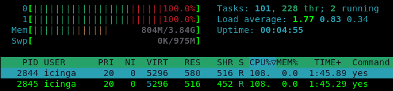
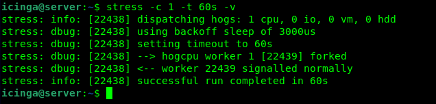
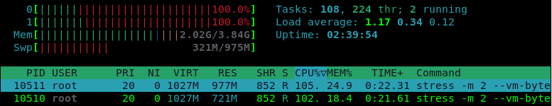

summary: BITI IPM Lab - Stress
id: biti-ipm-stress-linux-lab
categories: linux
tags: ipm, compute, cpu, BITI, introduction
status: Published
authors: Roland Pellegrini

# BITI IPM Lab - Stress
<!-- ------------------------ -->
## Before You Begin 

There are many reasons why you might want to stress test your Linux system. System administrators may want to see how their operating system and hardware perform under full load to detect software bugs or hardware failures.

### What You’ll Learn

In this codelab you will learn
* How to perform stress the CPU with an one-liner (Linux)
* How to perform stress the CPU using the stress application (Linux)

<aside class="negative">
Warning: Running the following tools with root privileges stress your system, so use them judiciously.
</aside>

### What You'll need

#### Guest operation system (Guest OS)

This is the OS of the virtual machine. This will be Debian 11 (Bullseye).

#### Administators privileges

By default, administrator privileges are required on the Host OS to install additional software. Make sure that you have the required permissions.

For the Guest OS, you will create and manage your own users. These users will therefore be different from the Host's user administration. 


## Stress with Yes

### Description
This one-liner creates a `yes` process that runs on each processor core of the machine. The `yes` command repeatedly prints the letter `y` until it terminates. It uses 100% of a CPU core. If Hyper-Threading is enabled, twice as many `yes` processes will be created.

### Sample code

Open a shell and run the following one-liner:

```
for i in $(seq $(getconf _NPROCESSORS_ONLN)); do yes > /dev/null & done
```

### Sample output

The output of this one-liner will look this:


The command `getconf _NPROCESSORS_ONLN` returns the number for CPU cores. The command `seq` prints a sequence of numbers from 1 up to the amount of CPU Cores. FInally, the look `for i in .... done` takes the sequence and starts a yes process for each of them, redirecting the output to dev/null.

As a result, the command `htop` shows the CPU utilization:



To kill all `yes` processes, run the following one-liner:

```
killall yes
```

## Stress with Stress

# Description
The `stress` program is a simple workload generator for POSIX systems. It allows system administrator to run a configurable amount of CPU, memory, disk and I/O stress on the target system.

### Sample code

Open a shell and run the following command with root privileges:

```
stress -c 1 -t 60s -v
```

Where,
* `-c 1`   : Run one (1) worker spinning on sqrt()
* `-t 60s` : Timeout after 60 seconds
* `-v`     : Be verbose

### Sample output
The output will look like this:




### Watch the results

To see how the stress commmand utilize the CPU, open a shell and start the `htop` application:
```
htop
```

The output will look something like this:


### Sample memory stress

Open a shell and run the following command with root privileges:

```
stress -m 2 --vm-bytes 1024M  -t 20s -v
```

Where,
* `-m 2`   : Run two (2) workers spinning on sync()
* `--vm-bytes 1024M` : malloc 1024MB per vm worker
* `-t 20s` : Timeout after 20 seconds


### Watch the results

To see how the stress commmand utilize Memory, open a shell and start the `htop` application:
```
htop
```

The output will look like this:


### Reference

Stressing the manual page:
```
man stress
```