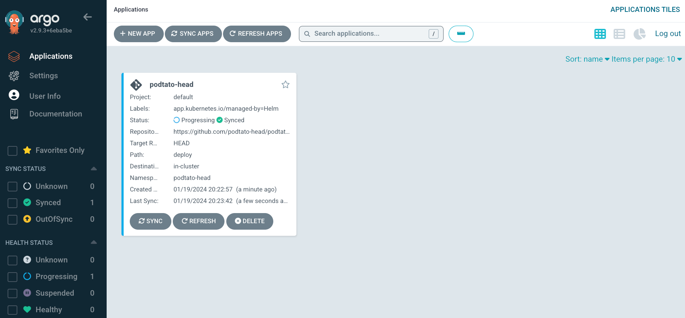

summary: Lab 2 - Combining OpenTofu and GitOps (Exoscale SKS Edition)
id: iac-opentofu-gitops
categories: terraform
tags: aws, MCCE, introduction, iac
status: Published
authors: Thomas Schuetz

# Infrastructure-as-Code - Lab 2 - Combining OpenTofu and GitOps (Exoscale SKS Edition)

<!-- ------------------------ -->

## What You’ll Learn


In this lab, you will:

- Add a GitOps Controller to your SKS Cluster
- Automatically deploy a simple application to your SKS Cluster

### Prerequisites

- [OpenTofu CLI](https://opentofu.org/docs/intro/install/)
- An SKS Cluster as created in Lab 1 (https://fhb-codelabs.netlify.app/codelabs/iac-opentofu-intro)
- An empty Git Repository (e.g. on Github)

## Add a GitOps Controller to your SKS Cluster using OpenTofu
At the moment, your SKS Cluster is empty and does not contain any applications. To deploy applications to your cluster, you need to add a GitOps Controller to your cluster. This controller will watch a Git Repository for changes and deploy the applications defined in this repository to your cluster.

Currently, there are two major GitOps Controllers available: [Flux](https://fluxcd.io/) and [ArgoCD](https://argoproj.github.io/argo-cd/). In this lab, we will use ArgoCD.

### Install ArgoCD using OpenTofu
Create a new configuration file called `argocd.tf` in your directory and copy the following content into it:

```terraform
resource "helm_release" "argo_cd" {
  name             = "argocd"
  repository       = "https://argoproj.github.io/argo-helm"
  chart            = "argo-cd"
  version          = "5.52.0"
  timeout          = 1200
  create_namespace = true
  namespace        = "argocd"
  lint             = true
  wait             = true

  depends_on = [
    exoscale_sks_kubeconfig.my_sks_kubeconfig
  ]
}
```
This configuration will install ArgoCD into your SKS Cluster using Helm. But wait ... What is Helm?

### Helm
Helm is a package manager for Kubernetes. It allows you to define applications in a standardized way and deploy them to your Kubernetes Cluster. Helm is a very powerful tool and we will use it in this lab to deploy ArgoCD to our SKS Cluster.

A package in Helm is called a Chart. A Chart is a collection of files that describe a related set of Kubernetes resources. A single Chart might be used to deploy something simple, like a single pod, or something complex, like a full web app stack with HTTP servers, databases, caches, and so on. The configuration of a Chart is done in a file called `values.yaml`. This file contains all the configuration options for the Chart. In our case, we will use the default configuration of ArgoCD.

As you might have noticed, we  will be using a new provider in this lab: The Helm Provider. This provider allows us to use Helm in our Terraform configuration. To use this provider, we need to add it to our `terraform.tf` file:

```terraform 
terraform {
  required_providers {
    exoscale = {
      source  = "exoscale/exoscale"
      version = "0.54.1"
    }
    helm = {
      source  = "hashicorp/helm"
      version = "2.12.1"
    }
  }
}

provider "helm" {
  kubernetes {
    config_path = "kubeconfig"
  }
}

provider "exoscale" {
[
...
]
}
```

As you can see, we added the Helm provider to our `terraform.tf` file. We also added the `kubernetes` block to the Helm provider. This block tells the Helm provider where to find the kubeconfig file for our SKS Cluster. We are using the kubeconfig file we created in Lab 1. There are prettier ways to do this, but for the sake of simplicity, we will use this approach in this lab.
        
### Deploy ArgoCD to your SKS Cluster
To deploy ArgoCD to your SKS Cluster, run the following command:

```bash
opentofu apply
```

Like in our previous lab, the configuration will be applied to your SKS Cluster. After this is applied successfully, you can check the status of your deployment by running the following command:

```bash
export KUBECONFIG=./kubeconfig
kubectl get pods -n argocd
```

After some time, you should see an output similar to this:

```bash
NAME                                                READY   STATUS    RESTARTS   AGE
argocd-application-controller-0                     1/1     Running   0          107s
argocd-applicationset-controller-67ff5ff488-x5k7p   1/1     Running   0          107s
argocd-dex-server-6867d888db-kz52l                  1/1     Running   0          107s
argocd-notifications-controller-7fc686d5df-4mzr4    1/1     Running   0          107s
argocd-redis-c89656499-j769p                        1/1     Running   0          107s
argocd-repo-server-6bbfdd5f8c-k565m                 1/1     Running   0          107s
argocd-server-6f69f5db45-g7xnl                      1/1     Running   0          107s
```

## First Steps with ArgoCD
After ArgoCD is deployed to your SKS Cluster, you can access the ArgoCD UI. At first, you need to get the password of the ArgoCD UI. To do so, run the following command:

```bash
kubectl get secret -n argocd argocd-initial-admin-secret -ojsonpath='{.data.password}' | base64 -d
```

This command will output the password of the ArgoCD UI. After that, you can set up a port-forward to the ArgoCD UI by running the following command
    
```bash
kubectl port-forward -n argocd svc/argocd-server 8888:80
```

After that, you can access the ArgoCD UI by opening the following URL in your browser: https://localhost:8080 and log in with the username `admin` and the password you got from the previous command. The ArgoCD UI should open and be very empty. This is because we have not yet defined any applications in our Git Repository.

<aside class="positive">
At this point, you can use the ArgoCD UI to deploy applications to your SKS Cluster. However, this is not the way we want to do it in this lab. We want to use GitOps to deploy applications to our SKS Cluster. Therefore, we will define our applications in a Git Repository and let ArgoCD watch this repository for changes. If you want to learn more about ArgoCD, you can check out the <a href="https://argoproj.github.io/argo-cd/" target="_blank">ArgoCD Documentation</a>.
</aside>

## Deploy a very simple application to your SKS Cluster
In this section, we will deploy a very simple application to our SKS Cluster. As we are still in the first steps of this lab, we will add the configuration for this application using OpenTofu. Therefore, we will add two more blocks to our `argocd.tf` file.

```terraform
locals {
  repo_url = "https://github.com/podtato-head/podtato-head-app"
  repo_path = "deploy"
  app_name = "podtato-head"
  app_namespace = "podtato-head"
}

resource "helm_release" "argo_cd_app" {
  name             = "argocd-apps"
  repository       = "https://argoproj.github.io/argo-helm"
  chart            = "argocd-apps"
  version          = "1.4.1"
  timeout          = 1200
  create_namespace = true
  namespace        = "argocd"
  lint             = true
  wait             = true
  values = [templatefile("app-values.yaml", {
    repo_url = local.repo_url
    repo_path = local.repo_path
    app_name = local.app_name
    app_namespace = local.app_namespace
  })]

  depends_on = [
    helm_release.argo_cd
  ]
}
```

This code block is written in Terraform and it's used to deploy an application to a Kubernetes cluster using ArgoCD and Helm.

The `locals` block defines local variables that specify the Git repository URL, the path in the repository, the application name, and the namespace for the application.

The `resource "helm_release" "argo_cd_app"` block deploys a Helm chart to the Kubernetes cluster. The chart is named `argocd-apps` and is fetched from the ArgoCD Helm repository. The chart version is `1.4.1`. The Helm release is deployed to the `argocd` namespace and a new namespace is created for it.

The argocd-apps Helm chart is used to deploy applications to ArgoCD. An application in ArgoCD is a Kubernetes resource that points to a Git repository and a path in this repository. ArgoCD will watch this repository and deploy the application to the Kubernetes cluster if there are any changes in the repository. 

The `values` attribute of the `helm_release` block uses a template file named `app-values.yaml`. This file is expected to contain the configuration values for the Helm chart. The values are populated using the local variables defined earlier.

The `depends_on` attribute ensures that the Helm release is only created after the ArgoCD Helm release is successfully deployed. This is because the ArgoCD Helm release is required for the application deployment.

After adding this code block to your `argocd.tf` file, you can deploy the application to your SKS Cluster by running the following command:

```bash
opentofu apply
```

After the deployment is finished, you can connect to the ArgoCD UI and check if the application is deployed successfully. Your ArgoCD UI should look similar to this:



<aside class="positive">
Congratulations! You have successfully deployed your first application to your SKS Cluster using GitOps!
</aside>

## Manage your application using GitOps
Until now, we have used OpenTofu to deploy our application to our SKS Cluster. However, our ultimate goal is to manage our applications using GitOps. Now is the time to create a Git Repository for your configuration, so if you haven't done this yet, please do so now.

Please mind that this is a central Git Repository that will contain the configuration for all your applications. It will not contain any source code or manifests for your applications. It will only contain the configuration for ArgoCD.

After you have created your Git Repository, you need to add it to your OpenTofu configuration. To do so, you need to change the locals block in your `argocd.tf` file:

```terraform
locals {
  repo_url = "<your git repository url>}"
  repo_path = "deploy"
  app_name = "gitops-base"
  app_namespace = "argocd"
}
```

After you have changed the locals block, you can deploy the configuration to your SKS Cluster by running `tofu apply`. After the deployment is finished, you can check the ArgoCD UI. You should see that the application is now managed by ArgoCD, but pretty empty.

## Add your application to your Git Repository
Finally, we should be able to add our application to our Git Repository. To do so, we need to add a new file to our Git Repository. The file should be named `podtato-head.yaml` and should contain the following content:

```yaml
apiVersion: argoproj.io/v1alpha1
kind: Application
metadata:
  name: podtato-head
  namespace: argocd
spec:
  project: default
  source:
    repoURL: https://github.com/podtato-head/podtato-head-app.git
    targetRevision: v0.3.0
    path: chart
  destination:
    server: https://kubernetes.default.svc
    namespace: podtato-helm
  syncPolicy:
    automated:
      selfHeal: true
      prune: true
    syncOptions:
      - CreateNamespace=true
```

After you added this file to your Git Repository, you can commit and push it. After that, you can check the ArgoCD UI. After a refresh or after some minutes, you should see that the application is now managed by ArgoCD and that it is deployed to your SKS Cluster.

<aside class="positive">
Congratulations! You have successfully deployed your first application to your SKS Cluster using GitOps! You can now add more applications to your Git Repository and deploy them to your SKS Cluster using GitOps.
</aside>

## Clean up
After you are done with this lab, you can clean up your SKS Cluster by running the following command:

```bash
tofu destroy
```

This will delete all resources that were created by this lab. Please mind that this will also delete your SKS Cluster. If you want to keep your SKS Cluster, you can delete the resources manually using the ArgoCD UI.