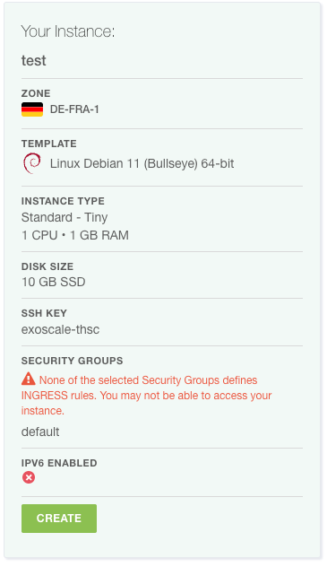

summary: Lab 1 - Terraform Introduction (Exoscale Edition)
id: iac-terraform-intro
categories: terraform
tags: aws, MCCE, introduction, iac
status: Published
authors: Thomas Schuetz

# Infrastructure-as-Code - Lab 1 - Terraform Introduction
<!-- ------------------------ -->

## What You’ll Learn


In this lab, you will: 
* Install Terraform
* Spin up a Virtual machine in Exoscale using the UI
* Provision a Virtual Machine in Exoscale using Terraform 

### Prerequisites
* [Terraform CLI](https://developer.hashicorp.com/terraform/downloads)
* IDE (IntelliJ IDEA, Visual Studio Code) with Terraform Plugin installed
* SSH Client installed (OpenSSH, PuTTY)

## Install Terraform
In the future, it will be more comfortable if you're able to use terraform from your PC and IDE.

To install terraform, refer to the respective documentation here:  
* [https://developer.hashicorp.com/terraform/downloads](https://developer.hashicorp.com/terraform/downloads)

**Please ensure, that the terraform binary is in your path!**
* [https://www.wikihow.com/Change-the-PATH-Environment-Variable-on-Windows](https://www.wikihow.com/Change-the-PATH-Environment-Variable-on-Windows)
* In Linux or MacOS, append the path you've chosen to your path variable (if the package installer didn't take care about this).

<aside class="positive">
Terraform is a single binary, therefore it is very handy to install and will not make any modifications on your system.
As you might want to use your IDE, it is recommended to run terraform directly on your machine instead of a virtual machine. 
If you want to do so, please ensure that you have a proper IDE running in your virtual machine.
</aside>

### Check if terraform is installed properly
To check if terraform is installed and as accessible, open a shell and run: `terraform version`. This should return the 
version of Terraform. If not and you changed the PATH before, ensure that you restarted your terminal and the Terraform
Binary is located in a directory which is accessible there.

## Exoscale Basics
Exoscale is a European Cloud Provider, which provides services as:
* Compute (Virtual Machines)
* Kubernetes (SKS)
* Database-as-a-Service (DBaaS)
* Object Storage (S3 Compatible)

During this lab, we will deal with virtual instances and object storage. In the first step, we will provision a virtual machine there.

You can log in to the Exoscale Console [here](https://portal.exoscale.com/login).  

## Creating a Virtual Machine in Exoscale

### Goal:
* You should be able to provision a Virtual Machine using the Exoscale UI
* Furthermore, you should get familiar a bit with Virtual Instances and things you can configure

### Task:
As a Cloud Engineer, your want to test a new tool. As you don't have the possibility to run a virtual machine on your machine, you
decide to run the machine in the cloud. After the machine is provisioned, you are running the tool you wanted to test and destroy
the Virtual Instance again.

### Checklist:
* [ ] Virtual Machine is provisioned
* [ ] You are able to connect to the virtual instance using SSH

<aside class="positive">
Try to solve the problem on your own / with your group. If you are experiencing problems, the following walkthrough will guide you.
</aside>

## Provisioning a Virtual Machine and access it via SSH
We will deploy the Virtual Machine via the Exoscale UI. Therefore, open the [Exoscale Console](https://portal.exoscale.com/login)
and Log In with your credentials.

### Create an SSH Key
You might want to be able to access your Virtual Machine after it is provisioned. Therefore, we need to precreate an SSH Key which can be used to access this machine.

This SSH Key has to be created on your machine. On Linux, Mac or WSL machines, this should work as follows:
* Open a shell (bash, zsh)
* Run `ssh-keygen -t ed25519 -f exoscale` (and remember where you ran this!)
  * Use a passphrase
* Open the private part of the key (exoscale.pub) and copy it.

The public part of the SSH Keypair has to be stored in Exoscale to make it usable in Virtual Machines. Therefore, select "Compute" -> "SSH-Keys" -> "Add",
assign a name you remember to the key and paste the public part.

### Provision the Virtual Machine
With this, we should have everything we need to provision a virtual machine.

* Select "Compute" -> "Instances" and click on "Add"
  * Assign a meaningful Hostname to your Instance
  * Use "Linux Debian 11 (Bullseye) 64-bit" as Template
  * Select the zone of your choice
  * Choose the Instance Type "tiny"
  * 10GB Storage will fit our needs
  * Select the Keypair you created before
  * Leave the IPv6 Options unchecked and the User Data Field Empty
  * Check your Configuration (as below and click on "Create")



* You will see a new screen, where your virtual instance is shown. After some times, it will get into a "running" state
* Make your self familiar with the information and options on this screen

### Access the Virtual Machine via SSH
In our lab, we might want to try out a tool and therefore it is beneficial to have shell access. Now it's time to remember
where you stored the private ssh key. When you found it, open up your shell and execute:
* `ssh -i <<path-to-your-private-key>> debian@<<ip-address-of-your-instance>>` (you can find the ip address on the instance screen)

You will find out that you are not able to connect to the machine. This is due to a missing security group.

<aside class="negative">You can imagine security groups as host-firewalls on cloud-based virtual instances. To access a
virtual instance from the public internet, you need a security-group rule to access it</aside>

### Adding a Security Group
To add the security group, select "Security Groups" in the "Compute" menu:
* Add a new security group ("Add"):
  * Name: `Public Access` and "Create Group"
  * On the Security Groups Overview Page, click on the three dots on the right side of the instance row and "Details"
  * Add a new Rule
    * Select "SSH"
  * Now you should see your new rule there
  * **In a real world scenario you would make sure that only your IP address could access the SSH port**
  * To assign the security group, open the instances screen, and select your instance
    * Click on "Security Groups"
    * Attach your Security Group
  * Retry accessing your machine via SSH now
  * This should work now

<aside class="positive">Congrats! You provisioned your first Virtual Machine and are able to access it!</aside>

## Infrastructure-as-Code
There were many steps we had to take until we got our simple virtual machine working. The current setup is fairly enough
to try out some new things, but in the real world you might want to do this in a more reproducible and scalable way.

This is where Infrastructure-as-Code comes into play. When you are provisioning 100s of instances, you might not want to
click through the consoles for every one you are provisioning. Infrastructure-as-Code (IaC) gives you the possibility to
configure your instances:
* As code
* In a declarative way
* Scalable
* With development best practices in mind.

Let's take a closer look on all of this.

*"Infrastructure-as-Code is an approach to infrastructure-automation based on practices from software development. It emphasizes 
consisten, repeatable routines for provisioning and changing systems and their configuration. You make changes to code, then 
use automation to tsest and apply those changes to your systems. (Kief Morris(2020), Infrastructure-as-Code, 2nd Edition)"*

When we're talking about Infrastructure-as-Code, we are no more creating our Infrastructure via the UI (ClickOps). Instead,
we are writing Code, mainly in a declarative way to describe the state, we want our Infrastructure to be in after it is applied.

Declarative configuration means that you express your intention (desired state), and a tool takes care of transitioning 
the managed objects to this state. Using imperative language, you would tell the tooling what it should do. You can distinguish
between these two styles using the following statements:
* Imperative: Dear Tool, execute command A, B and C
* Declarative: Dear Tool, please transition my infrastructure to exactly this state

Please note, that each declarative tool, will have some kind of imperative logic in it to transition to the state.

When we're provisioning Infrastructure-as-Code, we often have the possibility to modularize components, as well as having mechanisms 
in there, which help us creating multiple, similar objects. This are practices, we know from typical software development. 
As we are using practices from Software Development, we should also treat our Infrastructure as such. Therefore, the code should
be versioned, there should be automatic tests in place and pull requests should be on the order of the day.

There are many tools out there for Infrastructure-as-Code like:
* Terraform
* Pulumi
* Crossplane

Which tool you use, often depends on your own preferences and your use-cases. In this lab, we will take a closer look on Terraform.

Further Information / Videos:
* DevOps with Nana: Infrastructure-as-Code [https://www.youtube.com/watch?v=POPP2WTJ8es](https://www.youtube.com/watch?v=POPP2WTJ8es)

## Terraform
Before we will start with our first configuration, we will put some light on Terraform. 

Terraform is an Infrastructure-as-Code tool developed by Hashicorp. It uses a declarative language to describe infrastructure.
The language used is the "Hashicorp Configuration Language (HCL)". It is designed to work with many cloud providers. Nevertheless,
it is not really cloud-agnostic as knowledge about the individual providers is needed when writing the code.

To start using Terraform, we should be familiar with the following terms:
* **State:** The current configuration of our managed resources. The state can be stored in the local filesystem (terraform.tfstate),
  or remote backends, as S3 Buckets or consul
* **Provider:** Implements the commands needed to communicate with the cloud provider. e.g. an Exoscale provider knows how
  to talk to the Exoscale API and how to get from one state to another.
* **Resources:** The Objects you are creating and managing with terraform. As an example, a virtual machine is a resource.
* **Data Sources:** Describe objects we can query (!= write) in terraform. In amazon, the AMIs (Amazon Machine Images / Templates)
  are implemented as datasources you can query
* **Variables:** Give us the possibility to parametrize terraform configurations. 

For this lab, we will use a local state, Exoscale as provider and a Compute resource to create our Virtual Machine.

## Provisioning an Instance on Exoscale with Terraform

### Goal:
* You will be able to provision a very simple virtual machine using terraform

### Task:
Your Boss heard about a new technique to provision virtual instances. He tells you that you should get familiar with this
and provision the same virtual machine as before using Terraform

### Checklist:
* [ ] Virtual Machine is provisioned
* [ ] You are able to connect to the virtual instance using SSH

## Create your first terraform configuration
* Create a directory, where you want to store your configuration
* Open an IDE of your choice and open this directory

### Creating an API Key and Secret for Exoscale
* Open the Exoscale Console
* Click on "IAM" -> "API KEYS"
* Add Key
  * Give the Key a meaningful name
  * Restrict the Key to Compute
  * Click "Create" and store the credentials at a secure place

### Provider configuration
* Create a file called `terraform.tf` in your directory
* Copy the following block in the file, replace key and secret with your API secrets
* **Warning! When doing this on production environments (and in the next Labs), never store the secrets in this file,
  Instead, use mechanisms supported by the provider (e.g. Environment Variables)**
```terraform
terraform {
  required_providers {
    exoscale = {
      source  = "exoscale/exoscale"
      version = "0.48.0"
    }
  }
}

provider "exoscale" {
  key = "key"
  secret = "secret"
}
```
* This should be enough to run our first terraform command

```
terraform init
```

* This leads to the following output
```
Initializing the backend...

Initializing provider plugins...
- Finding exoscale/exoscale versions matching "0.48.0"...
- Installing exoscale/exoscale v0.48.0...
- Installed exoscale/exoscale v0.48.0 (signed by a HashiCorp partner, key ID 81426F034A3D05F7)

Partner and community providers are signed by their developers.
If you'd like to know more about provider signing, you can read about it here:
https://www.terraform.io/docs/cli/plugins/signing.html

Terraform has created a lock file .terraform.lock.hcl to record the provider
selections it made above. Include this file in your version control repository
so that Terraform can guarantee to make the same selections by default when
you run "terraform init" in the future.

Terraform has been successfully initialized!

You may now begin working with Terraform. Try running "terraform plan" to see
any changes that are required for your infrastructure. All Terraform commands
should now work.

If you ever set or change modules or backend configuration for Terraform,
rerun this command to reinitialize your working directory. If you forget, other
commands will detect it and remind you to do so if necessary.
```

<aside class="positive">
- Using this step, terraform initialized its (local) state and downloaded the provider from the terraform registry
</aside>

In the second step, we will try to create a virtual instance ...

## Deploy a virtual instance with Terraform

To do so, we'll create a second file called `main.tf`. Furthermore, we copy the following configuration in this file. Replace
the ssh_key with the name of the one you created before:
```terraform
data "exoscale_compute_template" "my_template" {
  zone = "at-vie-1"
  name = "Linux Ubuntu 22.04 LTS 64-bit"
}

data "exoscale_security_group" "public" {
  name = "<your-security-group-name>"
}

resource "exoscale_compute_instance" "my_instance" {
  zone = "at-vie-1"
  name = "my-instance"

  template_id = data.exoscale_compute_template.my_template.id
  type        = "standard.medium"
  disk_size   = 10
  ssh_key = "<your-ssh-key-name>"
  security_group_ids = [ data.exoscale_security_group.public.id ]
}
```

**Notable Things:**
* We imported our security group and used it for the new VM, we could already create the Security Group here
* The Machine Image is also imported
 
**[Data Sources](https://www.terraform.io/docs/language/data-sources/index.html)**
are here to get configurations from your cloud provider, but will change nothing and are used for referencing in other objects 

**[Resources](https://www.terraform.io/docs/language/resources/index.html)**
are objects you are managing with terraform

* Now we could try to find out what this would lead to
* Change to your terraform directory in the shell and execute:
```
terraform plan
```

* You get some output about the things which would happen now, most probably you'll see that one instance will be created
* If you are happy with that, apply this configuration
```
terraform apply
```

* You see the same output as before and get prompted if you really want to do this, accept with "yes"
* After a short period of time, you'll see the following output

```

❯ terraform apply
data.exoscale_security_group.public: Reading...
data.exoscale_compute_template.my_template: Reading...
data.exoscale_security_group.public: Read complete after 1s [id=8b225a34-9e8e-4583-a604-a64f61e9c4b9]
data.exoscale_compute_template.my_template: Read complete after 1s [id=5ef4024a-32bd-4ed4-8887-9bcb21290579]

Terraform used the selected providers to generate the following execution plan. Resource actions are indicated with the following symbols:
  + create

Terraform will perform the following actions:

  # exoscale_compute_instance.my_instance will be created
  + resource "exoscale_compute_instance" "my_instance" {
      + created_at          = (known after apply)
      + disk_size           = 10
      + id                  = (known after apply)
      + ipv6                = false
      + ipv6_address        = (known after apply)
      + name                = "my-instance"
      + private             = false
      + private_network_ids = (known after apply)
      + public_ip_address   = (known after apply)
      + security_group_ids  = [
          + "8b225a34-9e8e-4583-a604-a64f61e9c4b9",
        ]
      + ssh_key             = "exoscale-thsc"
      + state               = (known after apply)
      + template_id         = "5ef4024a-32bd-4ed4-8887-9bcb21290579"
      + type                = "standard.medium"
      + zone                = "at-vie-1"
    }

Plan: 1 to add, 0 to change, 0 to destroy.

Do you want to perform these actions?
  Terraform will perform the actions described above.
  Only 'yes' will be accepted to approve.

  Enter a value: yes

exoscale_compute_instance.my_instance: Creating...
exoscale_compute_instance.my_instance: Still creating... [10s elapsed]
exoscale_compute_instance.my_instance: Still creating... [20s elapsed]
exoscale_compute_instance.my_instance: Creation complete after 21s [id=f4ce2306-ff14-4e8d-8a8a-65e97b872931]

Apply complete! Resources: 1 added, 0 changed, 0 destroyed.
```

* You will see the new instance now in your Exoscale Console


  
* You should now also be able to access the instance via SSH with your Key (please note that the username is `ubuntu` now.

<aside class="positive">
- You created your first Exoscale Instance with Terraform
</aside>

## Deleting this instance
* After some time you might want to spin down your infrastructure (think of demos for courses)
* You can simply tear it down by typing
```
terraform destroy
```
* The tool will ask you if you are sure that you want to remove your instance
* Type yes
* After some time you see the following output:
```
Plan: 0 to add, 0 to change, 1 to destroy.

Do you really want to destroy all resources?
  Terraform will destroy all your managed infrastructure, as shown above.
  There is no undo. Only 'yes' will be accepted to confirm.

  Enter a value: yes

exoscale_compute_instance.my_instance: Destroying... [id=f4ce2306-ff14-4e8d-8a8a-65e97b872931]
exoscale_compute_instance.my_instance: Still destroying... [id=f4ce2306-ff14-4e8d-8a8a-65e97b872931, 10s elapsed]
exoscale_compute_instance.my_instance: Destruction complete after 13s

Destroy complete! Resources: 1 destroyed.
```
* If you take a look on the Exoscale Console, the Instance should be terminated

<aside class="positive">
- You deleted your first Exoscale Instance with Terraform, you made your first steps in Infrastructure-as-Code
</aside>