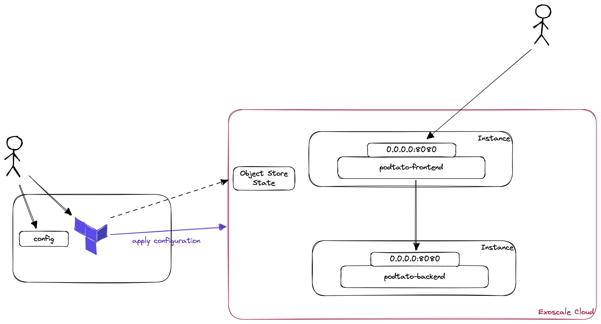

summary: Lab 2 - Installing a Microservice Application with Terraform (Exoscale Edition)
id: iac-terraform-exo-cloudinit
categories: terraform
tags: introduction, iac
status: Published
authors: Thomas Schuetz

# Infrastructure-as-Code - Lab 2 - Installing a Microservice Application with Terraform (Exoscale Edition)
<!-- ------------------------ -->

## What You’ll Learn



* Manage the Terraform State in an Object Store
* Install and Configure Virtual Machines via Terraform
* Configure Security Groups via Terraform
* Connect Microservice Components (Object Links) in Terraform

## Prerequisites
* Run the Lab "Lab 1 - Terraform Introduction (Exoscale Edition)"
* Create a new folder for this configuration
* Run terraform init to initially check that it works

<aside class="positive">
Ifi you ran the Lab 1 before, you can either remove the old .tf and .tfstate file (if you destroyed the infrastructure) to
start a new configuration here.
</aside>

## A new state
In the first lab, we managed our state locally in our filesystem. In the real world, this won't scale very well and might
be dangerous if you and other developers are using the same code on the same infrastructure. To overcome the issue of 
diverging states, terraform gives you the possibility to store the state centrally. In our case, we will use the Exoscale
Object Store.

### Creating a storage bucket
* Open the Exoscale Console (https://portal.exoscale.com/)
* Click on Storage
* Select "Add" to create a new bucket
  * Please mind, that you need the storage to store the terraform state, therefore it is not possible to create this store
  with this terraform configuration (chicken-egg-problem)
* Give the Bucket a meaningful name "terraform-asdadfk" and choose a zone
* Click on Create

### Set some environment variables (Linux / MacOS)
```
export AWS_ACCESS_KEY_ID=<EXOSCALE_API_KEY>
export AWS_SECRET_ACCESS_KEY=<EXOSCALE_API_SECRET>
export TF_VAR_access_key=${AWS_ACCESS_KEY_ID}
export TF_VAR_secret_key=${AWS_SECRET_ACCESS_KEY}
```

### Set some environment variables (Windows)
```
set AWS_ACCESS_KEY_ID=<EXOSCALE_API_KEY>
set AWS_SECRET_ACCESS_KEY=<EXOSCALE_API_SECRET>
set TF_VAR_access_key=%AWS_ACCESS_KEY_ID%
set TF_VAR_secret_key=%AWS_SECRET_ACCESS_KEY%
```

### Initialize the new state
* Create a file called `terraform.tf`
* Add the following configuration
```terraform
terraform {
  required_providers {
    exoscale = {
      source  = "exoscale/exoscale"
      version = "0.48.0"
    }
  }
  backend "s3" {
    bucket                      = "<bucket-name>"
    region                      = "at-vie-1"
    key                         = "terraform.tfstate"
    endpoint                    = "https://sos-at-vie-1.exo.io"
    skip_credentials_validation = true
    skip_region_validation      = true
  }
}

provider "exoscale" {
  key    = var.access_key
  secret = var.secret_key
}
```

There are lots of interesting things in there and some things changed between the first lab and this one:
* backend: We are defining a S3 Backend here, which means that our state will be stored in our object store
  * The Credentials are taken from the environment variables `AWS_ACCESS_KEY_ID` and `AWS_SECRET_ACCESS_KEY`. Mind, that
  the credentials for backends cannot be stored in variables.
* provider: We changed the provider configuration to use variables.

### Define Variables
As in many other programming language, we have to define our variables in the code. Most of the time, we will create a separate
file for our variables in terraform. Therefore, we will create a new file called `vars.tf` in our configuration folder and
add the following content:

```terraform
variable "secret_key" {
  type = string
  sensitive = true
}

variable "access_key" {
  type = string
  sensitive = true
}
```

There are different types of variables in terraform:
- string: e.g. "your name"
- number: e.g. 1
- bool: true
- maps and objects for more complex operations.

Using the sensitive = true directive, we can ensure that the content of this variable is not exposed in any output.

### Assigning Variables
There are various ways to assign variables:
* In the commandline
* using .tfvars files
* using environment variables

For this example, we already assigned environment variables; the ones which started with TF_VAR_.

### Setting up the state
Now we can initialize our new state using: `terraform init`. If you navigate to your bucket in the exoscale console, you should
see a terraform.tfstate object now.

## Initial Setup of Cloud Instances
* We will create 2 instances, a frontend and a backend service

* Create a file called main.tf
* Create the configuration for these 2 instances
``` terraform

# Data Source for getting the ubuntu template
data "exoscale_compute_template" "ubuntu_template" {
  zone = "at-vie-1"
  name = "Linux Ubuntu 22.04 LTS 64-bit"
}

# Resource for podtatohead-main
resource "exoscale_compute_instance" "podtatohead-frontend" {
  zone = "at-vie-1"
  name = "podtatohead-frontend"

  template_id = data.exoscale_compute_template.ubuntu_template.id
  type        = "standard.tiny"
  disk_size   = 10
}

# Resource for podtatohead-backend
resource "exoscale_compute_instance" "podtatohead-backend" {
  zone = "at-vie-1"
  name = "podtatohead-backend"

  template_id = data.exoscale_compute_template.ubuntu_template.id
  type        = "standard.tiny"
  disk_size   = 10
}
```

## Validate, plan and apply the configuration
* Switch to your shell and open the directory which contains your configuration
* To check if this configuration is syntactically correct and internally consistent, type `terraform validate`
* This should lead to following output
```
❯ terraform validate
Success! The configuration is valid.
```

* Afterwards, a dry-run of this using `terraform plan`
* The output should end like this:
```
Plan: 2 to add, 0 to change, 0 to destroy.

───────────────────────────────────────────────────────────────────────────────

Note: You didn't use the -out option to save this plan, so Terraform can't
guarantee to take exactly these actions if you run "terraform apply" now.
```
<aside class="negative">
Always inspect, what your configuration does and if this could have an impact on your application 
</aside>

* As there are only new objects created in this case, it's time to apply the configuration
* Type `terraform apply`
* You will get asked if you are sure that you want to perform these actions, type "yes". If you want to skip this question, you could start `terraform apply` with the parameter `--auto-approve` (but be sure what you're doing).
* Now, the instances get created and after that, you should see the following output:

```
[...]

Plan: 2 to add, 0 to change, 0 to destroy.
exoscale_compute_instance.podtatohead-frontend: Creating...
exoscale_compute_instance.podtatohead-backend: Creating...
exoscale_compute_instance.podtatohead-backend: Still creating... [10s elapsed]
exoscale_compute_instance.podtatohead-frontend: Still creating... [10s elapsed]
exoscale_compute_instance.podtatohead-frontend: Creation complete after 19s [id=i-0024742a855b87fe8]
exoscale_compute_instance.podtatohead-backend: Creation complete after 19s [id=i-095392d47383309ba]

Apply complete! Resources: 2 added, 0 changed, 0 destroyed.

```
<aside class="positive">
You created 4 instances using terraform, congratulations! 
</aside>

### Inspect our environment
* Open the Exoscale Console (Browser)
* Switch to Compute -> Instances

* You should see the following instances:
* 
* Edit: You should only see two instances here ...

* Currently, we should be aware of the following facts:
  * We provisioned 2, plain instances without any software installed
  * There is no security group configured, therefore nobody (even we!) will be able to access this instances
  * There is no ssh key attached to the instances

* Therefore, there's some more work to do

## Cloud Init
* Cloud Init can be used to run scripts after provisioning your Instances, we'll use this to install docker and run the podtatohead containers.

### Set up the Cloud Init Templates
* We will set up 1 template for the frontend service and one template for the backend service. 
* Create a directory called `templates` in your terraform directory
* Create a file `cloud_init.tpl` in the templates directory and add the following:

```shell
#!/bin/bash

sudo apt-get update
sudo apt-get install ca-certificates curl gnupg

sudo install -m 0755 -d /etc/apt/keyrings
curl -fsSL https://download.docker.com/linux/ubuntu/gpg | sudo gpg --dearmor -o /etc/apt/keyrings/docker.gpg
sudo chmod a+r /etc/apt/keyrings/docker.gpg

echo \
  "deb [arch="$(dpkg --print-architecture)" signed-by=/etc/apt/keyrings/docker.gpg] https://download.docker.com/linux/ubuntu \
  "$(. /etc/os-release && echo "$VERSION_CODENAME")" stable" | \
  sudo tee /etc/apt/sources.list.d/docker.list > /dev/null

sudo apt-get update

sudo apt-get install docker-ce docker-ce-cli containerd.io docker-buildx-plugin docker-compose-plugin -y

sudo mkdir -p /etc/podtatohead
sudo cat << EOF > /etc/podtatohead/servicesConfig.yaml
hat:       "http://${backend_ip}:8080"
left-leg:  "http://${backend_ip}:8080"
left-arm:  "http://${backend_ip}:8080"
right-leg: "http://${backend_ip}:8080"
right-arm: "http://${backend_ip}:8080"
EOF

%{ if component == "frontend" }
sudo docker run -p 8080:8080 -e PORT=8080 -e PODTATO_COMPONENT=${component} -e SERVICES_CONFIG_FILE_PATH=/etc/podtatohead/servicesConfig.yaml -v /etc/podtatohead/servicesConfig.yaml:/etc/podtatohead/servicesConfig.yaml -d ${container_image}:v${podtato_version}
%{ else }
sudo docker run -p 8080:8080 -e PORT=8080 -d ${container_image}:v${podtato_version}
%{ endif }
```

<aside class="negative">
The frontend service needs to know, where to find the other services, therefore also different variables are used
</aside>

### Use the Cloud Init Templates
* To use these templates, we have to refer to them in our terraform configuration
* Therefore, open the `main.tf` file in your Terraform folder
* Add the following line to the `podtatohead-frontend` resource
```
  user_data = templatefile("${path.module}/templates/cloud_init.tpl", { container_image = "ghcr.io/podtato-head/podtato-server", podtato_version=var.podtato_version, backend_ip = exoscale_compute_instance.podtatohead-backend.public_ip_address, component = "frontend" })
```

<aside class="negative">
We refer to the template file, we've created previously and set some variables. Note, that we're using the ip addresses of the other services from the corresponding resource entries.
</aside>

* Add the following line to the `podtatohead-backend` resource
```
  user_data = templatefile("${path.module}/templates/cloud_init.tpl", { container_image = "ghcr.io/podtato-head/podtato-server", podtato_version=var.podtato_version, backend_ip = "", component = "backend" })
```

* As a reference, the podtatohead-frontend resource should look as follows now:
```terraform
# Resource for podtatohead-main
resource "exoscale_compute_instance" "podtatohead-frontend" {
  zone = "at-vie-1"
  name = "podtatohead-frontend"

  template_id = data.exoscale_compute_template.ubuntu_template.id
  type        = "standard.tiny"
  disk_size   = 10
  user_data = templatefile("${path.module}/templates/cloud_init.tpl", { container_image = "ghcr.io/podtato-head/podtato-server", podtato_version=var.podtato_version, backend_ip = exoscale_compute_instance.podtatohead-backend.public_ip_address, component = "frontend" })
}
```

### Validate the configuration
* To validate this configuration, type `terraform validate`
* After that, we should see something like this:
```
│ Error: Reference to undeclared input variable
│
│   on main.tf line 25, in resource "exoscale_compute_instance" "podtatohead-backend":
│   25:   user_data = templatefile("${path.module}/templates/cloud_init.tpl", { container_image = "ghcr.io/podtato-head/podtato-server", podtato_version=var.podtato_version, backend_ip = "", component = "backend" })
│
│ An input variable with the name "podtato_version" has not been declared. This variable can be declared with a variable "podtato_version" {} block.
```
<aside class="negative">
It seems like we're missing some variables. Let's create them now!
</aside>

### Defining Variables
* To define the variables, open the `vars.tf` in your terraform folder
* Add the following to that file
```terraform
variable "podtato_version" {
  type = string
}
```
* When you are trying to apply the configuration now, you are asked for a version. Use `0.3.2` here.
<aside class="negative">
These variables define, which version of the podtatohead will be used
</aside>

### Assigning Variables
* These variables can be used in different ways (environment variables starting with TF_VAR or via a .tfvars file). In this example, we will use a tfvars file, which is automatically used when present.
* Create a file `terraform.tfvars` in your terraform directory and add the following content
```
podtato_version="0.3.2"
```

<aside class="negative">
Always ensure, that such vars files do not contain secrets, when checking them in in git.
</aside>

* Now, we created our variables and should be able to apply our configuration

### Tainting Resources
The Exoscale will not cause a restart of the containers and therefore, we have to force the restart of them. As a workaround:

* Run `terraform taint exoscale_compute_instance.podtatohead-frontend`
* Run `terraform taint exoscale_compute_instance.podtatohead-backend`

This will instruct Terraform to re-create the resources.

### Plan and apply the configuration
* `terraform validate` should pass now
* run `terraform plan` and inspect the output:

```
[...] 
Plan: 2 to add, 0 to change, 2 to destroy.

───────────────────────────────────────────────────────────────────────────────

Note: You didn't use the -out option to save this plan, so Terraform can't
guarantee to take exactly these actions if you run "terraform apply" now.
```

<aside class="negative">
You will delete 2 instance and create 2new ones. Note, that there are changes (like changes in cloud-init scripts) which enforce a recreation of the instance (immutable infrastructure). In our case this will be ok, in the real world you would take mechanisms in place which avoid the downtime (load balances, multiple instances).
</aside>

* run `terraform apply` 

<aside class="positive">
If your configuration has been applied successfully, you provisioned your virtual instances and the cloud init scripts should work now
</aside>

### Open a shell to your instances
* Try to open an SSH connection as we did it in the previous lesson

<aside class="negative">
When you take a closer look on the security groups of the instance, you might notice that there are no inbound rules. Therefore, SSH is also not working. Furthermore we don't have any ssh key assigned. Let's fix these issues!
</aside>

### Add your SSH Key to the configuration
* In the last lesson, you created an SSH Key to access the instances
* Find out which name you used, and add this to the instance configuration:+

```
  ssh_key="<your-key>"
```

## Create Security Groups
* To assign a security group in terraform, we have to create a `security_group` resource and assign it to an instance. 

<aside class="positive">
Our application needs two security groups, one for the ssh access and the second one for the connections between the services.
</aside>

* To create the Security Group, add the following resource block to your Terraform `main.tf` file:

```
resource "exoscale_security_group" "public_ingress" {
  name = "public-ingress"
}

resource "exoscale_security_group_rule" "rule_http" {
  security_group_id = exoscale_security_group.public_ingress.id
  type              = "INGRESS"
  protocol          = "TCP"
  cidr              = "0.0.0.0/0" # "::/0" for IPv6
  start_port        = 8080
  end_port          = 8080
}

resource "exoscale_security_group_rule" "rule_ssh" {
  security_group_id = exoscale_security_group.public_ingress.id
  type              = "INGRESS"
  protocol          = "TCP"
  cidr              = "0.0.0.0/0" # "::/0" for IPv6
  start_port        = 22
  end_port          = 22
}

```
<aside class="negative">
The security groups are very open in this example, in the real world this should be more specific
</aside>

### Assign the Security Groups
* These Security Groups can now be used in your instances, when you reference them as follows in your resource configuration:

```
 security_group_ids = [ exoscale_security_group.public_ingress.id ]
```

* A sample configuration should look like this now:
```
resource "exoscale_compute_instance" "podtatohead-frontend" {
  zone = "at-vie-1"
  name = "podtatohead-frontend"

  template_id = data.exoscale_compute_template.ubuntu_template.id
  type        = "standard.tiny"
  disk_size   = 10
  ssh_key="exoscale"
  user_data = templatefile("${path.module}/templates/cloud_init.tpl", { container_image = "ghcr.io/podtato-head/podtato-server", podtato_version=var.podtato_version, backend_ip = exoscale_compute_instance.podtatohead-backend.public_ip_address, component = "frontend" })
  security_group_ids = [ exoscale_security_group.public_ingress.id ]
}
```


### Apply the configuration
* Now you can validate, plan and apply your configuration again:
  * Taint frontend and backend
  * `terraform validate`
  * `terraform plan`
  * `terraform apply`

<aside class="negative">
  Note, that 3 additional resources (security groups) are created and the instances are only changed
</aside>

  * You should be able to access the podtatohead-application after some minutes

<aside class="negative">
You can lookup the public ip address of the podtato-head in the Exoscale Console, but there's a more convenient way to achieve this.
</aside>

## Outputs
* You can specify things which should declared as outputs in terraform, in our case we want to get the url for our podtatohead
* Create a file `outputs.tf` in your Terraform directory with the following contents

```
output "podtato-url" {
  value = "http://${exoscale_compute_instance.podtatohead-frontend.public_ip_address}:8080"
}
```

* Afterwards, do a `terraform refresh` to update the state
* In the outputs section, you can see the `podtato-url` which can be put in a browser, simply try to do this

## Congratulations
<aside class="positive">
If you see the PodTatoHead, you have successfully finished this lesson.


### Clean up
* After you have finished this lesson, simply remove everything using `terraform destroy`